# 비선형 분류란?

입력 데이터가 선형적으로 분류되지 않을 때 사용하는 분류 방법

# 비선형 분류 방법 두 가지를 설명하라. 

1. 다항 특성
   * 입력한 데이터에 다항 특성을 추가하여 비선형 데이터를 선형적으로 변환한다.
     즉, 원래 특성이 x인 경우, 새로운 특성으로 x^2, x^3 등을 추가하여 데이터를 변환한다. 
2. 유사 특성
   * 각 샘플과 특정 landmark 간의 유사도를 측정하여 새로운 특성을 만든다. 
3. kernel trick
   * 커널 함수를 사용하여 고차원 공간으로 매핑하는 효과를 주고 계산량도 줄인다. 

# kernel이란?

입력 데이터의 차원을 늘려주는 역할

# 커널 함수 예시 2가지

가우시안 RBF kernel, polynomial kernel

# SVC 작동 방식

1. 데이터 준비
2. 각 클래스의 데이터 포인트를 분리하는 최적의 평면을 찾는다. 
3. 마진에 가장 가까운 데이터 포인트들을 서포트 벡터로 선택한다. 
4. 학습된 모델을 사용해 새로운 데이터 포인트의 클래스를 예측한다. 

# 모델이 과대 적합이면 차수를 늘려야 한다. 

ㅗ. 차수를 줄여야 한다. 

# 처음에는 그리드의 폭을 작게 잡는다. 

ㅗ. 크게 잡는다. 

# 유사도 함수란?

각 샘플에 대해 특정 landmark와의 유사도를 측정하는 함수

# 가우시안 RBF 식을 작성하라. 

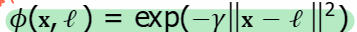

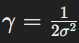

# 가우시안 RBF에서 gamma 가 클수록 폭이 넓은 종 모양이다. 

ㅗ. 작을수록

# 가우시안 RBF에서 gamma 가 클수록 샘플의 영향 범위가 좁아진다. 

맞음.

# 가우시안 RBF에서 gamma 가 큰 것은?

1. 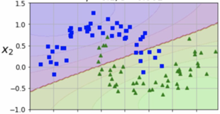

2. 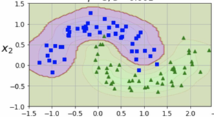

   2결정 경계가 불규칙해지고 샘플을 따라 휘어진다. 

# 다음 중 규제가 작은것은?

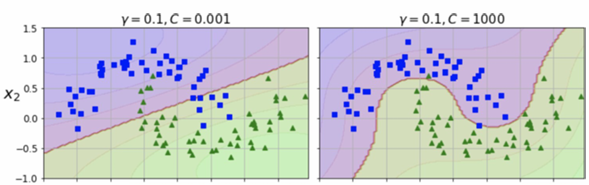

오른쪽. 규제는 과대적합 담당 일진이다.  C 값은 반대로 따라간다. 

# 유사도 특성을 추가하면 특성의 개수가 샘플의 개수와 같아진다. 

yes

# 유사도 함수의 장단점

장점

* 차원이 커지면서 선형적으로 구분이 될 확률이 높아짐

단점

* 훈련 세트가 매우 클 경우 아주 많은 특성이 생겨버려 ㅈㄴ 연산해야 한다. 

# SVM 회귀란?

마진 위반 발생 정도를 조절하면서 도로 폭을 최대한 넓혀서 도로 위에 가능한 많은 샘플을 포함하는 회귀 방식

#  SVM에게 도로 안 샘플은 마진 위반이다. 

ㅗ. 밖

# SVM 회귀 모델에서 손실 함수는 도로 폭 안에서의 오차에 민감하지 않다. 

맞음.도로폭에 민감하지 않음.

# 도로 폭 안의 오차는 모델의 성능에 영향을 준다. 

ㅗ. 안준다. 마진 폭과 실제 값은 관계가 없다. 그저 허용 오차 범위 일 뿐.

# 손실 함수에 영향을 주지 않는다면 모델의 예측에는 영향이 없다. 

맞음.

# 회귀 모델의 손실 함수

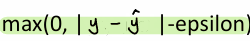

# 다음 중 C 값이 큰 것은?

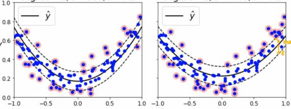

왼쪽. 더 샤프하다 == 규제가 약하다 == c가 크다

# 선형 SVM 모델의 결정함수

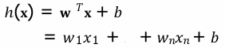

# 결정 함수의 역할

오류가 적거나(soft margin) 없는(hard margin) w를 찾기

# 결정 함수의 기울기가 작을수록 마진 폭도 작아진다. 

ㅗ. 마진 폭은 커진다. 

# 목적 함수 역할

결정함수의 기울기(w) 를 최적화 하기

# decision tree?

* 일련의 분류 규칙을 통해 데이터를 분류하거나 회귀하는 지도 학습 모델.

# 결정 트리 모델의 구조?

* 노드
  * 데이터를 분할하는 기준
* 가지
  * 노드의 결과
  * 다음 노드로 이어짐

# information gain = 

impurity of me - impurity of my child

# impurity의 concrete 2가지

1. gini index
2. entropy

# 다음 분포에서 entropy는?

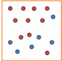

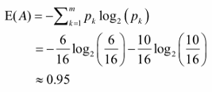

# 결정 트리 모델의 동작 원리?

1. root node의 지니 불순도 계산
2. 나머지 속성에 대해 분할 후 자식 노드의 불순도 계산
3. 각 속성에 대한 information gain 계산
4. information gain이 최대가 되는 분기 조건을 찾아 분기
5. 모든 leaf 노드의 불순도가 0이 될 때 까지 반복

# 다음 데이터로 make decision tree를 만들어라. 

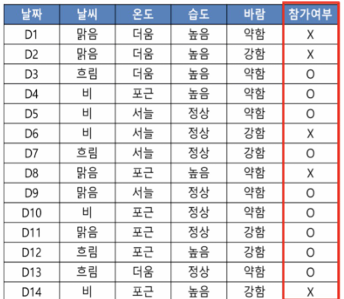

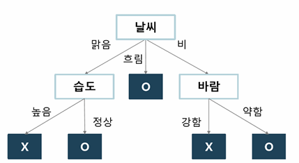

1. root node impurity 
   * 참가 여부를 root node로 가정
   * E(참가 여부) = -9/14log(9/14) - 5/14log(5/14) = 0.94
2. 나머지 속성에 대해 분할 수 자식의 불순도 계산
   * E(참가 여부|날씨) = P(맑음) * E(참가 여부|맑음) + P(흐림) * E(참가 여부| 흐림) + P(비) * E(참가 여부 | 비) = 

# A와 B기준 중 무엇을 선택해야 하나?

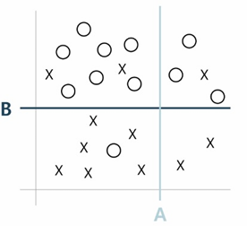

불순도가 더 적은 B

# decision tree 의 주요 장단점

#### 장점

1. **해석 용이성**: 결정트리 모델은 시각적으로 표현이 가능하며, 각 결정 과정이 명확하기 때문에 해석이 쉽습니다.
2. **비선형 관계 표현**: 복잡한 비선형 관계를 잘 포착할 수 있습니다.
3. **전처리 요구사항 낮음**: 데이터의 스케일링이나 정규화 등의 전처리 과정이 필요하지 않습니다.

#### 단점

1. 과적합(Overfitting) 문제
   - 설명: 결정 트리는 모든 데이터를 정확히 분류하려고 하므로, 훈련 데이터에 과적합될 가능성이 높습니다. 이는 특히 깊은 트리에서 두드러지며, 테스트 데이터에 대한 일반화 성능이 저하됩니다.
   - 대응 방법: 가지치기(Pruning), 최대 깊이 제한, 최소 샘플 수 제한 등의 규제 기법 사용.
2. 불안정성(High Variance)
   - 설명: 작은 데이터 변화에도 트리 구조가 크게 변할 수 있습니다. 이는 모델이 매우 민감하게 반응하여 예측 결과가 일관되지 않을 수 있음을 의미합니다.
   - 대응 방법: 배깅(Bagging)과 랜덤 포레스트(Random Forest)와 같은 앙상블 기법을 사용하여 안정성을 향상.
3. 특성 간의 상호작용 고려 어려움
   - 설명: 결정 트리는 한 번에 하나의 특성만을 기준으로 분할하기 때문에, 특성 간의 복잡한 상호작용을 충분히 반영하기 어렵습니다.
   - 대응 방법: 트리 기반의 앙상블 기법 사용.

# Class A : 40개, Class B : 35개, Class C : 25개 인 root node 의 지니 불순도 구하라

P(a) = 0.4
P(b) = 0.35
P(c) = 0.25

Gini = 1 - P(a) ^ 2 - P(b) ^ 2 - P(c) ^ 2

# Class A : 40개, Class B : 35개, Class C : 25개 인 root node의 엔트로피 불순도 구하라

E = -P(a)logP(a)-P(b)logP(b)-P(c)logP(c)

# CART란?

classification and regression tree.

# CART는 각 노드에서 가장 불순도를 많이 감소시키는 데이터 분할 방식을 택하는 greedy algorithm을 사용한다. 

맞음.

# decision tree는 항상 축에 수직인 분할을 사용해 조금만 회전해도 결정 경계가 많이 달라진다. 그래서 하는 방법은?

PCA로 훈련 샘플을 회전시킨 후 학습한다. 

# 앙상블 학습이란?

여러 개의 예측기의 결과를 종합해 예측 값을 도출하는 학습

# 투표식 분류기 종류 두 가지와 각 설명

1. 직접 투표: 수집된 예측 값 중에서 최빈값 선택
2. 간접 투표: 예측 확률 값들의 평균으로 최종 예측값 결정

# 가장 성능이 좋은 투표 방식은?

간접 투표

# 동일한 예측기를 훈련 세트의 다양한 부분 집합을 대상으로 학습시키는 방식 두 가지?

1. bagging
2. pasting

# bagging은 중복되지 않게 sampling

ㅗ. 구걸하는데 중복이 대수임?

# bagging & pasting 예측 방식이 선택한 분류 모델,회귀 모델은?

분류 모델: 직접 투표

회귀 모델: 수집된 예측 값들의 평균 값

# 분산(variance)란?

모델이 학습 데이터에 얼마나 민감하게 반응하는지. 높으면 과대적합

# 편향이란?

예측 값과 실제 값의 차이

# 앙상블의 편향과 분산은 개별 예측기와 비교해서 어떤가?

편향은 비슷한데, 분산은 적어서 과대 적합 위험이 적다 .

# bagging & pasting방식을 사용하면 개별 예측기의 편향이 작아져 과소 적합된다. 

ㅗ. 편향이 커진다. 

# pasting은 upper bias and lower variance

ㅗ. bagging이다. 

# random forest?

bagging을 사용해 만든 데이터셋으로 특성 또한 랜덤하게 골라 decision tree들을 만들어 앙상블 하는 기법

# random forest와 extra trees 의 차이 두가지?

extra trees 는 특성 뿐 아니라 특성 임계값도 무작위로(최적 분할 값 어림도 없지) 골라 속도가 훨씬 빠르다.

# random forest는 각 특성이 예측에 기여한 정도를 측정할 수 있다.  즉, ? 을 평가할 수 있나?

특성 중요도

# boosting?

약한 모델을 선형으로 연결시켜 순차적으로 학습시켜 성능을 높이는 방법

# 부스팅 예시 2가지

adaboost, gradient boosting

# 과소 적합했던 샘플들에 대한 가중치를 올려 새로운 모델을 만들어 추가하는 방식은?

adaboost

# gradient boosting?

이전 단계의 residual error를 보정하는 새로운 모델을 만들어 추가하는 방식

# 각 앙상블의 이름과 원리를 비교하라

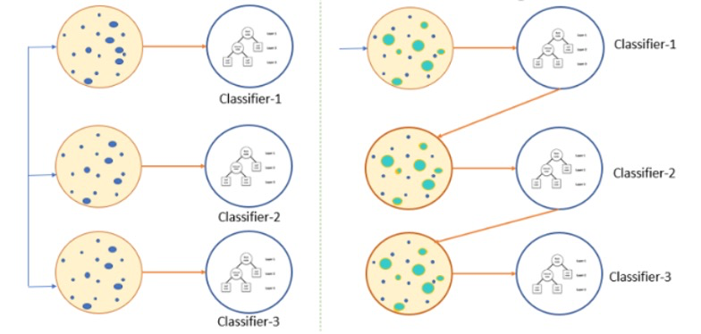

#### 왼쪽 그림: 배깅 (Bagging)

데이터를 중복 허용해 샘플링하여 개별 모델들에 학습시킨 후, 모델들의 예측 평균을 내거나 직접 투표 방식으로 예측하는 방법

병렬 학습, 다수결로 합산

#### 오른쪽 그림: 부스팅 (Boosting)

약한 모델을 선형적으로 연결해 순차적으로 학습시켜, 이전 모델이 잘못 예측한 샘플들에 더 가중치를 주거나, 이전 단계의 residual error를 보정하는 모델을 새로 만들어 추가하는 방법

순차 학습, 순차적으로 가중치 조정

# 차원의 저주란?

차원이 증가할수록 데이터 간의 거리가 멀어지고, 예측 모델의 성능이 저하된다. 

# 차원의 저주를 풀려면?

샘플 수를 늘리거나 차원을 축소하여 과대 적합을 방지한다.

# 차원 축소 기법 두 가지

* projection
* manifold learning

# manifold 가정?

고차원의 데이터 집합은 저차원의 manifold 상에 위치할 수 있다. 

# projection 을 구현할 알고리즘

* PCA
* kernel PCA

# manifold 을 구현할 알고리즘

* LLE

# PCA란?

* 최대한 데이터의 분산을 보존하면서 저차원으로 사영하는 기법

# PCA의 주 성분은 어떻게 찾나?

* 분산을 최대한 보존할 수 있는 주성분을 잡아야 한다.
* SVD(특이값 분해)
* 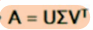

# SVD(고윳값 분해)

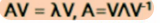

# kernel pca

비선형 데이터 구조를 고차원으로 변형하여 선형적으로 분리

# LLE

국소적 관계를 유지하면서 저차원으로 펼치는 비선형 차원 축소 기법

# 비지도 학습이란?

레이블이 없는 학습

# 비지도 학습 예제

* clustering
* 이상치 탐지
* 밀도 추정

# clustering 예시 한가지

* 비슷한 이미지 찾기

# 분류와 군집의 차이점

군집은 미리 라벨이 지정되니 않고, 예측기 스스로가 적절한 군집을 찾아야 함.

# k 평균 알고리즘의 동작 방식

1. k개의 centroid 랜덤하게 선택
2. 각 샘플을 가까운 centroid에 할당
3. 군집별로 샘플의 평균을 계산하여 새로운 centroid 지정
4. centroid가 안움직일 때 까지 2,3 반복

# k 평균 알고리즘 단점

1. 군집의 크기 차이가 크거나 원형이 아니면 잘 작동하지 않음
2. 랜덤하게 결정된 초기 centroid에 따라 정말 다른 군집이 생긴다.
3. 군집수를 미리 정해놔야 함
4. 최적의 모델을 찾기 위해 학습 여러번 해야 함.

# clustering 종류 2가지

1. soft clustering

   데이터가 여러개의 군집에 속할 수 있다. 

2. hard clustering

   데이터가 한개의 군집에만 속할 수 있다. 

# cluster 개수가 증가하면 inertia가 감소한다. 

맞음. sample과 가장 가까운 centroid 까지 거리^2 의 합이니까

# inertia가 작을수록 좋다.

ㅗ. 어차피 cluster 많아지면 inertia는 줄어드는데, 중간에 확 꺾이는 지점이 쓸만하다. 

# 실루엣 계수 = 

(클러스터 내부 거리 - 다른 클러스터 까지 거리) / max(분자)

# DBSCAN?

연속적인 밀집 지역을 하나의 군집으로 설정하는 기법.

# DBSCAN은 군집의 모양과 개수에 예민하다.

ㅗ. 전혀 노예민

# DBSCAN의 hyper parameter

* 이웃 범위
* 이웃 수

# DBSCAN의 장단점

장점

* 군집의 모양과 개수에 노상관
* 이상치에 안정적

단점

* 계산 복잡함
* 군집간 밀집도가 크게 다르면 군집 파악 잘 못함.

# DBSCAN의 시공간 복잡도

시간 :nlogn

공간:n^2

# 가장 간단한 인공신경만 구조는?

perceptron

# 