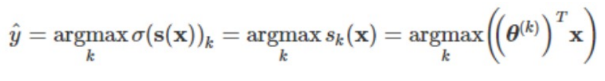

## 머신러닝?

명시적인 프로그래밍 없이 컴퓨터가 학습하는 능력을 갖추게 하는 분야

## 머신러닝 프로그램이 학습하는데 사용하는 데이터 집합?

training set

## training instance?

각각의 학습용 데이터

## 머신러닝을 왜 사용하는가?

전통적인 프로그램은 새로운 규칙이 생겼을 때 사용자가 매번 업데이트 해 줘야함.

머신러닝은 주기적으로 다시 훈련시키기만 하면 알아서 반영함.

## 머신러닝 학습 자동화?

MLOps

머신러닝 파이프라인

새롭게 얻은 데이터를 알고리즘을 다시 훈련하는데 사용하는 전 과정을 자동으로 진행

## 머신 러닝의 장점?

* 복잡한 문제 해결 가능
* 새로운 데이터에 쉽게 적응
* 복잡한 문제와 대량의 데이터에서 통찰을 얻음

## 머신러닝 적용 분류와 사례 4가지?

* 이미지 분류
  * 고품질 아몬드 분류
* 시맨틱 분할
  * 뇌 종양 진단
* 텍스트 분류
  * 댓글 욕설 감지
* 텍스트 요약
  * 긴 문서 자동 요약
* 자연어 이해
  * 챗봇
* 회귀 분석
  * 내년 수익 예측
* 음성 인식
  * 음성 명령에 반응하는 앱
* 군집 작업
  * 구매 이력 기반 고객 분류
* 이상치 탐지
  * 신용카드 부정 거래 감지
* 데이터 시각화
  * 그래프 효율적으로 표현
* 추천 시스템
  * 구매 이력 기반 상품 추천
* 강화 학습
  * 지능형 게임 봇

# 머신러닝 분류 기준 3가지?

1. 훈련 지도 여부
2. 실시간 훈련 여부
3. 예측 모델 사용 여부

## 분류 기준은 상호 배타적이다 .

ㅗ.

# 머신 러닝을 훈련 지도 여부로 분류하라

* 지도 학습
* 비지도 학습
* 준지도 학습
* 강화 학습

## 머신 러닝을 실시간 훈련 여부로 분류하라

* 온라인 학습
* 배치 학습

# 머신 러닝을 예측 모델 사용 여부로 분류하라

* 사례 기반 학습
* 모델 기반 학습

## 정답이 있는 학습은 비지도 학습이다.

ㅗ. 지도 학습이다.

## 대표적인 지도 학습 2가지

1. 분류
2. 회귀

## 지도 학습 알고리즘을 3가지만

1. linear regression
2. logistic regression
3. support vector machine
4. knn
5. decision tree & random forest
6. neural network

# 대표적인 비지도학습 4가지

1. 군집
3. 차원 축소
4. 연관규칙 학습

# 차원 축소의 장점?

상관관계가 있는 여러 특성을 하나로 합쳐서,
메모리 사용 공간이 줄어들고 + 훈련 실행 속도가 빨라져,
머신러닝 알고리즘 성능이 향상

## 준지도 학습에서 훈련데이터에 label이 없다.

ㅗ. 일부만 있다. 

# 준지도 학습은 지도 학습  후 비지도 학습을 한다. 

ㅗ. 비지도 학습을 통해 군집을 분류한 후, 지도 학습을 시킨다. 

## 강화 학습이란?

환경을 정의하고 
알고리즘이 환겨 안에서 행동을 관찰하고 보상 || 벌점을 제공하고
agent는 보상이 최대화 되도록 행동을 결정한다. 

## 컴퓨팅 자원이 한정적이거나, 새로운 데이터가 자주 들어오면 배치 학습해야한다.

ㅗ. 온라인 학습 해야한다. 

## 매우 큰 데이터셋을 활용한다면 배치학습니다.

ㅗ. 온라인 학습해야 한다. 

# 예측을 위해 기존 샘플과의 유사도를 측정하는 머신러닝 방식은?

사례 기반 학습

## 모델 기반 학습에서는 사례 기반 학습과 달리 모델을 미리 정하고 모델을 훈련시킨다.

맞음.

## 비용 함수 값이 클수록 모델은 좋다.

ㅗ. 값이 작을수록 좋다.

## 규제를 완화하면 과대 적합을 줄일 수 있다.

 ㅗ. 과대 적합 막으려고 규제 하는건데? 규제하면 단순해져.

## 규제를 강화하면 과소 적합을 막을 수 있다.

ㅗ. 규제를 완화해야 generalized 되지. 

## 과대 적합 해결 방법

1. 훈련 데이터에 있는 특성 수 줄인다.
2. 모델에 제약을 가해 단순화 시킨다.
3. 훈련 데이터 늘인다.
4. 훈련 데이터의 오류 데이터를 수정하거나 이상치를 제거한다.
5. 모델의 차수를 줄이거나 파라미터 수를 줄인다. 

## 하이퍼 파라미터가 많아질수록, 규제가 많아진다.

ㅇㅇ

## 하이퍼 파라미터는 학습 알고리즘의 동작 방식을 결정한다.

ㅇㅇ

# 훈련오차에 비해 일반화 오차가 적으면 과소적합이다.

ㅗ. 과대 적합이겠자.

## 검증 테스트가 필요한 이유는?

테스트 데이터셋에 과적합 되는 것을 막기 위해서다. 겸사겸사 모델의 하이퍼 파라미터도 조정한다.

## 검증 테스트에 과적합 되는건 어떻게 막을건가?

교차 검증을 하면 된다. 

- 전체 데이터셋을 k개의 폴드로 나눕니다.
- 각 폴드를 한 번씩 검증 세트로 사용하고, 나머지 폴드는 훈련 세트로 사용합니다.
- 이 과정을 k번 반복하여 모든 폴드가 한 번씩 검증 세트로 사용되도록 합니다.
- 각 반복에서 모델을 훈련하고 검증 세트에 대한 성능을 평가합니다.
- k번의 성능을 평균내어 최종 성능을 산출합니다.

# 데이터 불일치는 언제 발생하나?

훈련 데이터가 실전에 사용되는 데이터를 대변하지 못할 때.

# No Free Lunch

주어진 데이터셋에 가장 적합한 모델은 미리 알 수 없음.

----

## 다음 중 오차에 더 민감한 것은?


RMSE

## 샘플링을 하는 두가지 방법

1. 무작위 sampling
2. 계층적 sampling

# housing 데이터 셋에 대해 ocean_proximity를 기준으로 계층적 sampling을 하려 한다. 필요한 훈련셋:테스트셋=8:2이다. 계층적으로 sampling 된 것을 보여라.

```python
from sklearn.model_selection import StratifiedShuffleSplit
split = StratifiedShuffleSplit(n_splits=1, test_size=0.2, random_state=777)
for train_index, test_index in split.split(housing, housing["ocean_proximity"]):
  train_datasets = housing.loc[train_index]
  test_datasets = housing.loc[test_index]
print(train_datasets['ocean_proximity'].value_counts() / len(train_datasets))
print(test_datasets['ocean_proximity'].value_counts()/ len(test_datasets))
```

# housing의 median_house_value가 다른 특성과 어떤 상관관계가 있는지 descending으로 알려줘

```python
housing_corr = housing.loc[:, housing.columns != 'ocean_proximity'].corr() 
housing_corr['median_hous_value'].sort_vlaues(ascending=False)
```

## 결과물이 다음과 같을 때, 두번째로 상관관계가 높은 것은?


latitude. 0에서 멀수록 상관 관계가 높다. 

## 모델 학습을 효율적으로 하기 진행하기 위해 주어진 데이터를 변환시키는 것을 뭐라고 하는가?

데이터 전처리

# 수치형 데이터 전처리 과정 3가지

1. 데이터 정제
2. 조합 특성 추가
3. 특성 스캐일링

## 특성 스케일링이란?

특성간 범주 크기를 맞추는 작업

## 범주형 데이터 전처리 과정 1가지

원 핫 인코딩

## (추정기)estimator란?

데이터 셋을 기반으로,  모델 파라미터들을 추정하는 객체. 

> 데이터 학습

## 다음 estimator 예제에서 빈 칸에 들어갈 메소드명은?

```python
from sklearn.linear_model import LinearRegression

# 데이터 준비
X = [[1], [2], [3]]
y = [2, 4, 6]

# 추정기 객체 생성
model = LinearRegression()

# 모델 학습
model.[   ](X, y)

# 모델 파라미터 확인
print("Coefficient:", model.coef_)
print("Intercept:", model.intercept_)
```

`fit`

## transformer란?

1. `transformer.fit(data)`로 평균, 표준편차, 고윳값 등 데이터를 변환하는데 필요한 정보들 계산
2. `final_ data = transformer.transform(data)`로 데이터 변환

> 데이터 변환

## predictor란?

만들어진  모델로  테스트 셋에 대한 결과 예측

## 다음 코드를 설명하라

```python
from sklearn.preprocessing import OneHotEncoder
cat_encoder = OneHotEncoder()
housing_cat_1hot = cat_encoder.fit_transform(housing[['ocean_proximity']])
print(housing_cat_1hot.toarray())
```

OneHotEncoder 클래스: 범주형 변수를 One-Hot 인코딩으로 변환합니다.

fit_transform = 범주형 데이터들의 고윳값을 찾아냄 + 데이터 인코딩

## 다음 코드에서 빈 곳에 들어갈 메소드는?

```python
from sklearn.linear_model import LinearRegression

# 데이터 준비
X_train = [[1], [2], [3]]
y_train = [2, 4, 6]
X_test = [[4], [5]]

# 예측기 객체 생성
model = LinearRegression()

# 모델 학습
model.fit(X_train, y_train)

# 예측 수행
y_pred = model.[    ](X_test)

print("Predictions:", y_pred)

# 예측 성능 평가 (R^2 score)
score = model.[   ](X_test, [8, 10])
print("R^2 Score:", score)
```

* `predict`
* `score`

# housing에서 “total_bedrooms” col이 NaN인 row를 날리는 코드를 작성하라

`housing.dropna(subset=["total_bedrooms"], inplace=True)`

# housing에서 “total_bedrooms”coldl NaN이면 중간 값으로 채워넣는 코드를 작성해라.

```python
m = housing["total_bedrooms"].median()
housing["total_bedrooms"].fillna(m, inplace=True)
```

# min-max scaling이란?

x = (x - min) / (max - min)

## min-max에서 이상치가 매우 크면 무슨 일이 벌어지나?

분모가 커져서 변환된 값이 0에 몰린다.

## 표준화는 정규화이다.

ㅗ. min-max scaling이 정규화(normalization)이고, 표준화(standardization)은 x = (x - avg) / 표준편차**2 

# 정규화가 표준화보다 이상치 영향을 더 많이 받는다. 

ㅇㅇ

## transformer.fit()도  transformer.transform()처럼 훈련 데이터에 대해서만 적용한다.

fit()는 훈련 데이터에만 사용하는 것이 맞는데, transform()은 훈련데이터 뿐 아니라 테스트 데이터에도 사용된다.

## class sklearn.pipeline.Pipeline(steps) 란?

데이터 전처리 transformers와 모델 훈련 estimator를 연결해 놓은 것.

# 회귀 모델의 성능 측정 지표

* rmse
* mae

# RMSE = ?


# MAE = ?


## k겹 교차 검증에 대해 설명하라

1. 훈련 세트를 fold라 불리는 k개의 부분집합으로 무작위로 분할
2. 총 k번 지정된 모델을 훈련
   1. 훈련 할 때 마다 매번 다른 하나의 폴드를 평가에 사용
   2. 나머지 k  - 1 개의 폴드를 이용해 훈련
3. 최종적으로 k번의 평가 결과가 담긴 배열 생성

## 다음 코드 중 틀린 내용은?

```python
from sklearn.model_selection import cross_val_score
scores = cross_val_score(tree_reg, housing_prepared, housing_labels, scoring="mean_squared_error", cv=10)
tree_rmse_scores = np.sqrt(scores)
```

* line2: mean_squared_error -> neg_mean_squared_error
* line3: scores -> -scores

## 앙상블 학습이란?

여러 다른 모델을 모아서 하나의 모델을 만드는 기법

# 모델 세뷰 튜닝 3가지

1. 그리드 탐색
2. 랜덤 탐색
3. 앙상블 방법

## 다음 코드에서 총 훈련 횟수는?

```python
from sklearn.model_selection import GridSearchCV
param_grid = [
  {'n_estimators': [1,2,3], 'max_features':[1,2,3,4]}
  {'boot_strap': [False], 'n_estimators':[1,2], 'max_features':[1,2,3]}
]
forest_reg = RandomForestRegressor(random_state=42)
grid_search = GridSearchCV(forest_reg, param_grid, cv=5, scoring='neg_mean_squared_error', return_train_score=True)
```

(3 * 4 + 2 * 3) * 5 = 90

## 다음 코드에서 총 훈련 횟수는?

```python
from sklearn.model_selection import RandomizedSearchCV
from scipy.stats import randint

param_distribs = {
    'n_estimators': randint(low=1, high=200),
    'max_features': randint(low=1, high=8),
}

forest_reg = RandomForestRegressor(random_state=42)
rnd_search = RandomizedSearchCV(forest_reg, param_distributions=param_distribs,
                                n_iter=10, cv=5, scoring='neg_mean_squared_error',
                                random_state=42)
rnd_search.fit(housing_prepared, housing_label)
```

10 * 5 = 50

----

## 다음 관계식은 multivariable인가 multivariate인가?


multivariate

## 다음 관계식은 multivariable인가 multivariate인가?


multivariable

## SGD는 무엇의 약자인가?

stochastic gradient descent

# SGD 분류기는 어떤 방식으로 학습하나?

한번에 하나씩 훈련 샘플을 처리하고 파라미터 조정

# 성능 측정 방법 3가지

* 교차 검증→정확도 측정
* 오차 행렬 →정밀도/재현율 확인
* AUC 측정

## 정확도란 전체 샘플을 대상으로 정확하게 예측한 비율이다.

맞음

## 빈 칸에 들어올 값은?

```python
from sklearn.linear_model import SGDClassifier
model = SGDClassifier(max_iter=1000, tol=1e-3, random_state=99)
mode.fit(X_train, y_train)
from sklearn.model_selection import cross_val_score
cross_val_score(model, X_train, y_train, cv=3, scoring="[   ]")
```

accuracy

## 오차행렬에서 숫자 5의 이미지 sample이 숫자 3의 이미지 sample로 분류된 횟수를 알고 싶다면 어디를 봐야 할까?

6행 4열. 오차 행렬에서 행은 실제 클래스를, 열은 예측된 클래스를 의미한다.

## 어떤 이미지가 숫자 5인지 분류하는 model에 대해 다음 코드를 실행한 결과가 다음과 같다. 숫자 5인 이미지를 맞춘 횟수와, 숫자 5가 아닌 이미지를 맞춘 횟수는?

```python
from sklearn.metrics import confusion_matrix
confusion_matrix(y_train, y_train_pred)
```


* TP : 3530
* TN: 53892

| (음성, 음성)TN | (음성, 양성)FP |
| -------------- | -------------- |
| (양성, 음성)FN | (양성, 양성)TP |

True => 정답입니다~!

# 위 결과에서 재현율(TPR)은 얼마인가?

recall = TP / (TP + FN) = 3530 / (3530 + 1891)

5 이미지들을 채점했을 때 맞출 확률

# 위 결과에서 정밀도는 얼마인가?

precision = TP / (TP + FP) = 3530 / (3530 + 687)

5일거라고 적은 애들 중에 진짜 맞췄을 확률

## 위 결과에서 특이도는 얼마인가?

specificity = TN / (TN + FP) =     53982  / (53982 + 687)

5가 아닌 이미지들을 채점했을 때 맞출 확률

# 위 결과에서 정확도는 얼마인가?

accuracy = (TP + TN) / (전체) = (53892 + 3530) / (53892 + 687 + 1891 + 3530)

## 위 결과에서 F1 score는 얼마인가?

F1 = (1 + 1^2) * precision * recall / ((1^2 * precision) + recall)

## 위 결과에서 FPR은 얼마인가?

false positive rate

FPR = FP / (FP + TN) = 687 / (687 + 53892)

## F1 score란?

정밀도와 재현율의 조화 평균

## 정밀도가 증가하면 재현율도 증가한다.

ㅗ. 재현율은 감소한다. 이를 정밀도/재현율 trade off라고 한다.

# 결정 함수란?

분류기가 각 샘플의 점수를 계산할 때 사용

## 결정 임계값이란?

결정 함수의 값에 대해 클래스를 구분하는 기준 값. 넘으면 양성 클래스 되는거임.

## 결정 임계값이 클수록 정밀도는 감소하고 재현율은 증가한다.

ㅗ. 결정 임계값↑ → 정밀도↑ == 재현율↓

## ROC 곡선이란?

receiver operating characteristic

FPR - TPR 곡선

## ROC 곡선 하단의 면적을 뭐라고 하는가?

 AUC

##  ROC에서 TPR이 증가할수록 FPR도 증가한다.

맞음

## TPR이 높고 FPR이 낮은 것이 좋은 분류기이다.

맞음

## 다음 분류기 중 다중 클래스 분류기를 고르시오

- [ ] 로지스틱 회기
- [ ] 서포트 벡터 머신
- [x] SGD
- [x] random forest
- [x] softmax regression

# 랜덤 포레스트 분류기는 온라인 학습을 지원한다. 

ㅗ. 

sgd → 배치 + 온라인

랜덤 포레스트 분류기 → 배치

## 이진분류기로는 다중 분류를 할 수 있는 방법 2가지

* 일대다 방식(OVR)
* 일대일 방식(OVO)

# OVR에 대해 설명하라

숫자 5 예측하기에서 사용한 이진 분류 방식을 모든 숫자에 대해서 실행했을 때, → 각 샘플에 대해 총 10번의 각기 다른 이진분류를 실행했을 때

각 분류기의 결정 점수 중 가장 높은 클래스를 고른다.

# OVO에 대해 설명하라

훈련세트의 각 샘플에 대해 조합 가능한 모든 일대일 분류 (n + .. + 2 + 1)를 실행했을 때, → 샘플당 10개 점수 반환

가장 많이 이긴 숫자를 선택한다.

## 다음 오차율 이미지에 대해 틀린 말을 찾아봐라.


- [ ] 전반적으로 클래스 불문 데이터 생긴게 8이랑 비슷하다
- [ ] 5랑 3이랑 헷갈리게 적었다.
- [ ] 클래스 8에 속한 것 치고 오해받을 일은 없다.

## 이미지 분류기의 한계

* 이미지의 위치나 회전 방향에 민감

## 다중 레이블 분류는 샘플마다 여러개의 클래스[T/F]를 출력한다.

맞음

## 다중 출력 분류

다중 레이블 + 한 레이블이 다중 클래스가 될 수 있도록

---

## 경사 하강법의 종류 3가지

* 배치 경사 하강법
* 미니 배치 경사 하강법
* 확률적 경사 하강법(sgd)

# n개의 특성을 사용하는 선형 회귀 모델 함수를 작성하라.


## 벡터 형식으로 MSE를 작성하라.


## 행렬 형식으로 MSE를 작성하라.


## 비용 함수가 최소가 되게 하는 ceta를 찾는 방법 2가지

* 정규 방정식 or SVD(특이값 분해) 으로 최소 ceta 계산
* 경사 하강법

# 정규 방정식의 단점

계산 복잡도가 O(n^2)이라 특성 수(n)가 큰 경우 높은 시/공간 복잡도가 발생

## 정규 방정식을 작성하라

MSE를 미분하면 됨. X` = X^T


## 경사 하강법이란? 수식과 함께 작성하라.

훈련 중 파라미터를 비용함수가 작아지는 방향으로 조금씩 반복적으로 조정하는 것


# gradient MSE(ceta) = ?


## 경사 하강법의 eta, 시작점에 대해 생길 수 있는 문제점

* eta가 작을 경우 최솟값에 너무 느리게 수렴한다.
* eta가 클 경우 최솟값에 수렴하지 않을 수 있다.
* 시작점 위치에 따라 지역 최솟값에 빠질 수 있다.

## 학습률이란?

비용함수의 parameter를 조정하는 크기

# 학습 모델을 지정할 때 사람이 지정해 주는 값은?

hyper parameter

## epoch

전체 훈련 데이터를 훈련하는 단계

## epoch 수?

책 몇번 복습할 건지

## batch 크기

몇장씩 보고 ceta 수정할건지

## tolerance

비용함수의 gradient vector size < tolerance : 학습 종료

## step

given batch size의 샘플을 학습하고 parameter를 조정하는 단계

## 훈련 세트 크기 = 1000, batch size = 10, step 수는?

스텝 수 = 훈련 샘플 수 / 배치 크기 = 1000 / 10

## 배치 경사 하강법에서 배치 크기는 전체 훈련 샘플 수의 반이다.

ㅗ. 한 권 다 읽고 파라미터 조정한다.

## 확률적 경사하강법의 배치 크기는?

1

## 사이킷런에서 배치 경사 하강법을 지원함

ㅗ. 안함

## 허용 오차를 1/10으로 줄이려면 에포크 수를 어떻게 해야 하나?

10배 늘린다.

## 확률적 경사 하강법에 대한 설명으로 틀린 것은?

- [ ] 매우 큰 훈련 세트를 다룰 수 있음
- [ ] 외부 메모리 학습을 할 수 있음
- [ ] 지역 최솟값에 빠질 위험이 적음
- [ ] 전역 최솟값에 수렴하지 못하고 계속 발산할 수도 있음
- [x] 훈련 데이터가 클수록 계산 복잡도/메모리 문제 생김
- [ ] 파라미터의 동요가 심할 수 있음

# 확률적 경사 하강법에서 요동치는 파라미터를 제어하기 위해, 에포크, 훈련 샘플 수, 학습되는 샘플의 인덱스에 따라 학습률을 지정하는 것을 뭐라고 하는가?

학습 스케줄

# 배치 크기가 클수록 지역 최솟값에 수렴할 위험이 커진다.

맞음

## 경사하강법에서 스케일 조정이 필요한 이유는?

* 수렴 속도가 빨라진다.
* 비용함수 등고선이 원형에 가까워져서 수렴점을 찾기가 쉬워진다.

# 다항 회귀란?

특성 변수들을 추가한 선형 회귀를 이용해 비선형 데이터를 학습하는 기법

## 다음 학습 곡선은 과소적합인가 과대적합인가?


과소적합

## 어떤 모델이 과대 적합이면 무엇을 해야 하나?

검증 데이터 성능이 훈련 데이터 성능 따라잡을 때 까지 훈련 데이터를 늘린다.

## 다항 선형 회귀의 자유도는 특성 수이다.

ㅗ. 차수이다. 자유도가 특성수라면 그건 단순 선형 회귀일 것이다.

## 자유도를 제한하는 것을?

규제

## 단순 선형 회귀 모델에 규제를 가하는 것은, 차수를 줄이는 것이다.

ㅗ. 줄일 차수가 어딨노. 필요없는 특성 수를 줄이는 것이지. 즉 "가중치 역할  제한"

# 가중치 역할을 제한하는 선형 회귀 모델 3가지

* 릿지 회귀
* 라쏘 회귀
* 엘라스틱넷

# 규제 항은 테스트 과정에도 사용된다.

ㅗ. 훈련 과정에만 사용된다.

# 릿지 회귀의 비용 함수 J(ceta) = ?


# 라쏘 회귀의 비용 함수 J(ceta) = ?


# ceta_0도 규제에 포함된다.

ㅗ. 안됨

# ceta가 0이 될 수 있는 가중치 역할 제한 선형 회귀 모델은 릿지와 라쏘 중 무엇인가?

라쏘. 절대값을 쓰는 거니까 쌉가능

# 특징들 중 일부만 중요하면 릿지와 라쏘 중 무엇을 써야 할까?

라쏘

# 릿지에서 모든 ceta가 골고루 증가해야 비용 함수가 줄어든다.

ㅗ. 0에 가까워 져야 한다.

# alpha가 컸을 때에 대한 설명이 아닌 것은?

- [ ] 과소적합
- [x] 복잡도 증가
- [ ] 패널티 효과 증가
- [x] 계수에 제한이 없다.

## 엘라스틱넷이란?

릿지 회귀와 라쏘 회귀가 합쳐진 모델

# 엘라스틱넷의 비용 함수


# 특성 수가 훈련 샘플 수보다 크거나, 특성 몇개가 강하게 연관되어 있다면 라쏘 규제가 적절

ㅗ. 엘라스틱넷

## 조기 종료 기법이 필요한 이유는?

너무 복습을 많이 할 경우(epoch ↑) 과대적합이 생기기 때문이다.

# 결정계수R^2


# 결정 계수가 0이라면 과대적합인가 과소적합인가?

둘 다 아니다. 100% 설명력을 가진 좋은 모델이 탄생한거지

## 로그오즈 = ?

ln(p / (1 - p) )

# logistic regression = ?


h(x) = 

## logistic 회귀에서는 양성 클래스는 높은 확률을, 음성 클래스는 낮은 확률을 점치는 ceta를 찾아야 한다.

맞음.

# 로지스틱 회귀 모델의 비용함수


양성 클래스든, 음수 클래스든,  틀린 예측을 하면 값이 커진다.

## 소프트 맥스 회귀는 다중 출력 지원 가능하다.

ㅗ. 불가능

# softmax regression = ?





---

## SVM은 무엇의 약자인가?

support vector machine

# 선형 SVM을 분류해봐라

* 라지 마진 분류
* 하드 마진 분류
* 소프트 마진 분류

## 라지 마진 분류란?

분류 대상 클래스들 사이의 가장 큰 도로(마진)을 계산하여 클래스를 분류한다.

## 도로의 중앙선을 뭐라고 부르는가?

결정 경계

## 다음 이미지에서 왼쪽에서 무슨 짓을 했길래 오른쪽 처럼 결정 경계가 좋아진 것인가?

특성 스케일

## 모든 훈련 샘플이 올바르게 분류되도록 하는 마진 분류는 하드 마진 분류이다.

맞음.그래서 이상치 있으면 포기해야됨

## 마진 분류에서 훈련 샘플이 도로 위에 있거나, 해당 클래스 반대편에 있는 상황을 뭐라고 하는가?

마진 위반

## 마진 분류에서 규제(c)가 크다는 말은, 도로폭이 더럽게 좁다는 의미로 마진 위반을 줄여보겠다는 의도다.

맞음

# 비용 함수인 hinge loss = ?

hinge loss = max(0, 1 - ty)

t:정답 (1 || -1)

y:예측 값

