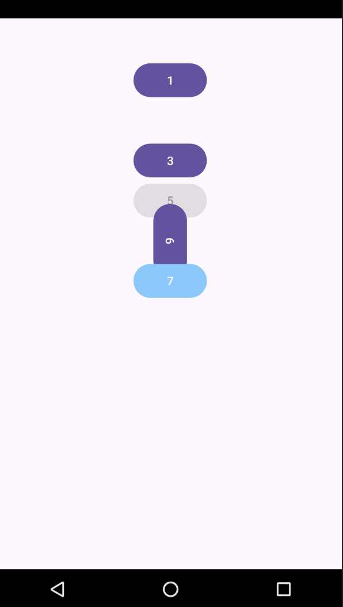
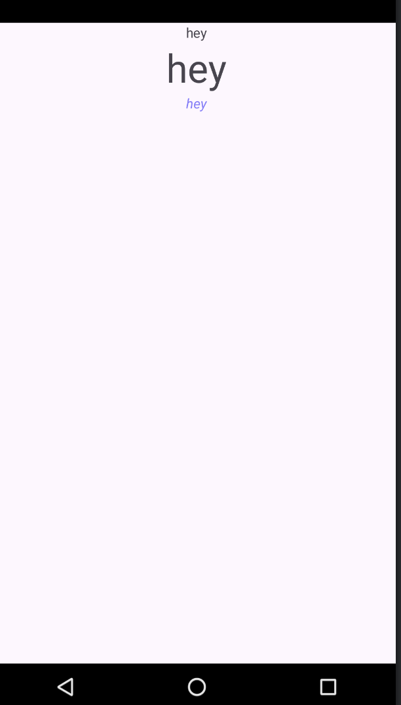
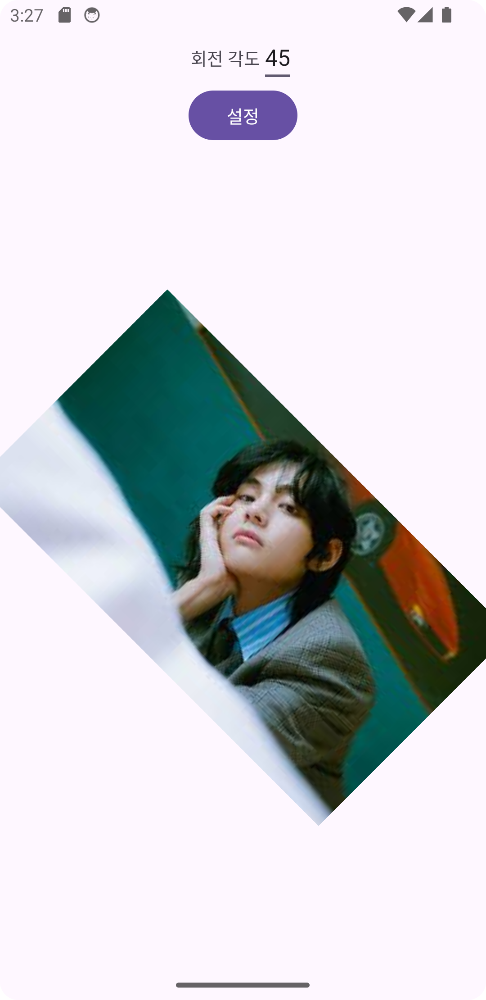
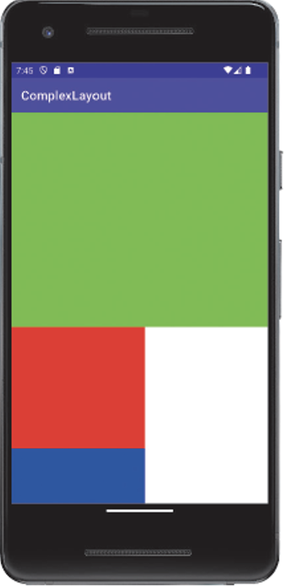
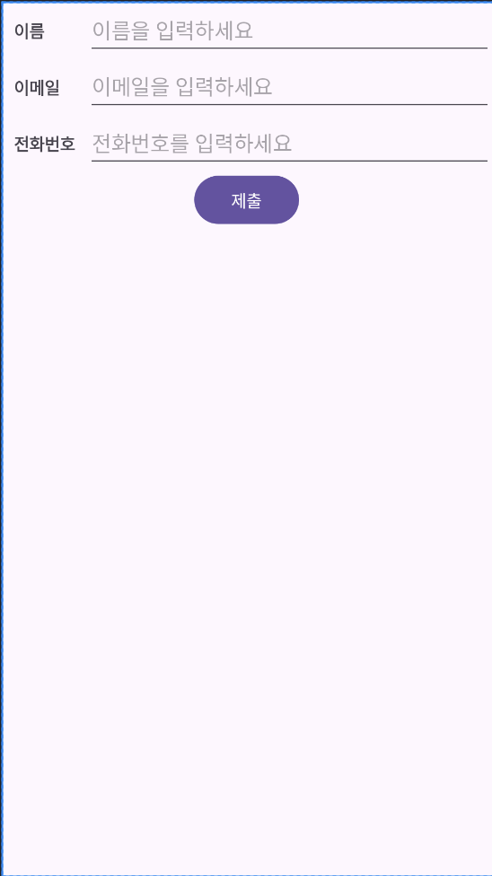
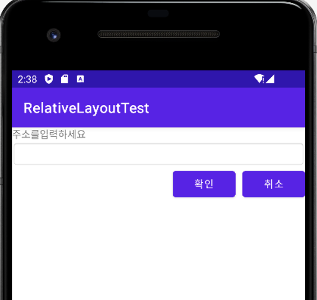
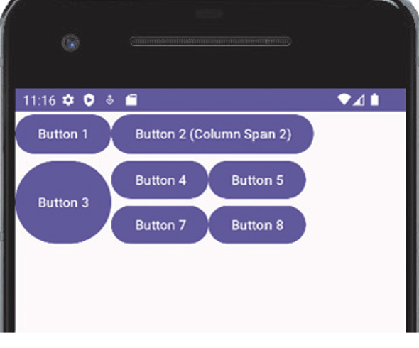
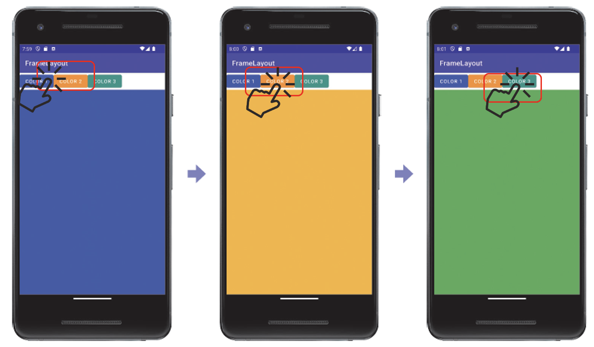
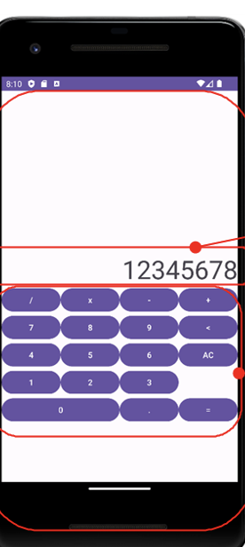

# 새 emulator 만들 때 어떤 도구를 사용하나?

AVD Manager

# AVD는 emulator의 instance다. 

맞음

# 안드로이드 공식 개발 도구는?

android studio

# 앱을 가상으로 실행할 수 있는 장치는?

AVD

# 안드로이드의 이전 버전 SDK를 설치하려고 한다. 어떤 도구를 사용하나?

SDK Manager

# 안드로이드 OS를 만든 회사는?

Android.Inc

## 안드로이드 application을 구성하는 4가지 component

* activity
* service
* broadcast receiver
* content provider

# 사용자를 상대하는 화면을 가지는 component?

activity

# background에서 실행되는 component로서 오랫동안 실행되는 작업을 위한 component?

service

## 방송을 받고 반응하는 component

broadcast receiver

# 데이터를 관리하고 다른 application에 제공하는 component

content provider

# 안드로이드 앱에서는 다른 앱이 가진 component를 실행할 수 없다.

ㅗ.있다. 

# application의 의도를 이것에 적어서 안드로이드에 전달하면 안드로이드가 적당한 component찾아서 처리한다. 이것은?

intent

# 안드로이드 앱을 개발할 때 4가지 종류의 component를 전부 사용해야 한다.

ㅗ. 필요한것만 써라 .

# 사용자 인터페이스가 저장되는 파일은?

xml

# 빌드 도구로 사용되는 것은?

Gradle

# main()역할을 하는 메소드?

각 activity의 onCreate()

## 리소스들이 모여 있는 폴더 이름은?

res

## 리소스들이 기본적으로 사용하는 언어는?

xml

# 화면의 구성을 기술한 리소스는 어떤 폴더에 모여 있는가?

layout

# 아이콘 파일들이 저장된 폴더는?

drawable

## activity_main.xml을  화면으로 쓰고 싶다. 코드를 작성하라.

`setContentView(R.layout.activity_main)`


## 사용자 인터페이스 요소를 2가지로 분류하라.

* View
* ViewGroup

# 안드로이드의 모든 위젯이 상속하는 클래스는?

View

## activity 화면을 설정하는 메소드?

`setContentView()`

# activity에서 아이디로 뷰를 찾는 메소드?

`findViewById()`

# 자식 뷰가 부모 뷰의 공간을 전부 차지하게 하려면 뷰의 크기를 어떻게 저장해야 하나?

match_parent

## 크기를 나타내는 단위 중에서 장치 독립적인 단위가 아닌 것 두가지?

- [ ] dp
- [x] px
- [ ] pt
- [x] sp
- [ ] mm
- [ ] in

# layout file에서 white 색상을 올바르게 나타내면?

#FFFFFF

# 텍스트 뷰에서 텍스트를 변경할 때 사용하는 메소드는?

setText()

# layout 클래스는 어떤 클래스를 상속받나?

ViewGroup

# 자식 뷰들을 선형으로 배치하는 레이아웃은?

LinearLayout

# 자식 뷰들을 겹치게 배치하는 layout?

FrameLayout

# 비주얼 도구가 사용하는 layout?

ConstraintLayout

# 선형 layout에서 방향결정하는 xml속성?

orientation

# LinearLayout에서 부모로부터 자신의 위치를 변경하려면 android:gravity를 설정하면 된다. 

ㅗ. android:layout_gravity

# 뷰의 속성 중 android:layout_width와 android:layout_height를 match_parent로 지정하면 어떻게 뷰가 표시되나?

가로 세로 방향으로 부모의 공간을 모두 차지한다. 

# padding은 view 밖에 있다.

ㅗ. margin이겠지.

# 다음 이미지에는 view가 5개 있다. 빈칸에 들어갈 내용은?



```xml
<?xml version="1.0" encoding="utf-8"?>
<LinearLayout xmlns:android="http://schemas.android.com/apk/res/android"
    xmlns:app="http://schemas.android.com/apk/res-auto"
    xmlns:tools="http://schemas.android.com/tools"
    android:id="@+id/main"
    android:layout_width="match_parent"
    android:layout_height="match_parent"
    android:layout_margin="50dp"
    android:gravity="center_horizontal"
    android:orientation="vertical"
    tools:context=".twelveth">

    <Button
        android:layout_width="wrap_content"
        android:layout_height="wrap_content"
        android:text="1" />

    <Button
        android:layout_width="wrap_content"
        android:layout_height="wrap_content"
        android:text="2"
        android:[1]="invisible" />

    <Button
        android:layout_width="wrap_content"
        android:layout_height="wrap_content"
        android:text="3" />

    <Button
        android:layout_width="wrap_content"
        android:layout_height="wrap_content"
        android:text="4"
        android:visibility="[2]" />

    <Button
        android:layout_width="wrap_content"
        android:layout_height="wrap_content"
        android:[3]="false"
        android:text="5" />

    <Button
        android:layout_width="wrap_content"
        android:layout_height="wrap_content"
        android:[4]="90"
        android:text="6" />

    <Button
        android:layout_width="wrap_content"
        android:layout_height="wrap_content"
        android:[5]="@color/sky_blue"
        android:text="7" />


</LinearLayout>
```

1. visibility
2. gone
3. enabled
4. rotation
5. backgroundTint

# 다음 빈 칸에 들어갈 내용은?



```xml
<?xml version="1.0" encoding="utf-8"?>
<LinearLayout xmlns:android="http://schemas.android.com/apk/res/android"
    xmlns:app="http://schemas.android.com/apk/res-auto"
    xmlns:tools="http://schemas.android.com/tools"
    android:id="@+id/main"
    android:layout_width="match_parent"
    android:layout_height="match_parent"
    tools:context=".fourteenth"
    android:orientation="vertical"
    android:gravity="center_horizontal"
    >
    <TextView
        android:layout_width="wrap_content"
        android:layout_height="wrap_content"
        android:text="hey" />
    <TextView
        android:layout_width="wrap_content"
        android:layout_height="wrap_content"
        android:text="hey"
        android:[1]="40dp"
        />
    <TextView
        android:layout_width="wrap_content"
        android:layout_height="wrap_content"
        android:text="hey"
        android:[2]="@color/soft_purple"
        android:backgroundTint="@color/sky_blue"
        android:[3]="italic"/>
</LinearLayout>
```

1. textSize
2. textColor
3. textStyle

# 01각도를 입력하고 “회전”버튼을 누르면 이미지가 회전하는 앱을 작성해보자. 이미지는 이미지 뷰로 표시한다.



```xml
<?xml version="1.0" encoding="utf-8"?>
<LinearLayout xmlns:android="http://schemas.android.com/apk/res/android"
    xmlns:app="http://schemas.android.com/apk/res-auto"
    xmlns:tools="http://schemas.android.com/tools"
    android:layout_width="match_parent"
    android:layout_height="match_parent"
    android:orientation="vertical"
    tools:context=".first"
    android:gravity="center">

    <LinearLayout
        android:layout_width="match_parent"
        android:layout_height="wrap_content"
        android:gravity="center">

        <TextView
            android:layout_width="wrap_content"
            android:layout_height="wrap_content"
            android:text="회전 각도" />

        <EditText
            android:id="@+id/rotation_value"
            android:layout_width="wrap_content"
            android:layout_height="wrap_content" />

    </LinearLayout>

    <Button
        android:id="@+id/setting"
        android:layout_width="wrap_content"
        android:layout_height="wrap_content"
        android:text="설정" />

    <[1]
        android:id="@+id/first_image"
        android:layout_width="match_parent"
        android:layout_height="match_parent"
        android:[2]="@drawable/first" />

</LinearLayout>
```

1. ImageView
2. src

```java
package com.example.helloandroid;

import android.os.Bundle;

import com.google.android.material.snackbar.Snackbar;

import androidx.appcompat.app.AppCompatActivity;

import android.view.View;
import android.widget.Button;
import android.widget.EditText;
import android.widget.ImageView;

import androidx.navigation.NavController;
import androidx.navigation.Navigation;
import androidx.navigation.ui.AppBarConfiguration;
import androidx.navigation.ui.NavigationUI;

import com.example.helloandroid.databinding.ActivityFirstBinding;

public class first extends AppCompatActivity {

    @Override
    protected void onCreate(Bundle savedInstanceState) {
        super.onCreate(savedInstanceState);
        setContentView(R.layout.activity_first);
        Button button = (Button) findViewById(R.id.setting);
        button.[3](new View.[4]() {
            @Override
            [5](View v) {
                ImageView imageView = (ImageView) findViewById(R.id.first_image);
                EditText editText = (EditText) findViewById(R.id.rotation_value);
                imageView.[6](Integer.parseInt(editText.getText().toString()));
            }
        });
    }
}
```

3. setOnClickListener
4. OnClickListener
5. public void onClick
6. setRotation

# 02LinearLayout만을 사용해 다음과 같은 layout을 구성하라.



```xml
<?xml version="1.0" encoding="utf-8"?>
<LinearLayout xmlns:android="http://schemas.android.com/apk/res/android"
    xmlns:app="http://schemas.android.com/apk/res-auto"
    xmlns:tools="http://schemas.android.com/tools"
    android:id="@+id/main"
    android:layout_width="match_parent"
    android:layout_height="match_parent"
    android:orientation="vertical"
    tools:context=".second">

    <LinearLayout
        android:layout_width="match_parent"
        android:layout_height="[1]"
        android:[2]="1"
        android:[3]="@color/sky_blue" />

    <LinearLayout
        android:layout_width="match_parent"
        android:layout_height="0dp"
        android:layout_weight="1"
        >

        <LinearLayout
            android:layout_width="[4]"
            android:layout_height="match_parent"
            android:layout_weight="1"
            android:orientation="[5]">

            <LinearLayout
                android:layout_width="match_parent"
                android:layout_height="0dp"
                android:layout_weight="1"
                android:background="@color/purple" />

            <LinearLayout
                android:layout_width="match_parent"
                android:layout_height="0dp"
                android:layout_weight="1"
                android:background="@color/white" />
        </LinearLayout>

        <LinearLayout
            android:layout_width="[4]"
            android:layout_height="match_parent"
            android:layout_weight="1"
            android:background="@color/black" />
    </LinearLayout>
</LinearLayout>
```

1. 0dp
2. layout_weight
3. background
4. 0dp
5. vertical

# 03다음과 같은 뷰를 TableLayout으로 만들어라.



```xml
<?xml version="1.0" encoding="utf-8"?>
<TableLayout xmlns:android="http://schemas.android.com/apk/res/android"
    android:layout_width="match_parent"
    android:layout_height="match_parent"
    android:[1]="1">

    <[2]>
        <TextView
            android:text="이름"
            android:padding="10dp"
            android:textStyle="bold" />

        <EditText
            android:id="@+id/editTextName"
            android:hint="이름을 입력하세요" />
    </[2]>

    <[2]>
        <TextView
            android:text="이메일"
            android:padding="10dp"
            android:textStyle="bold" />

        <EditText
            android:id="@+id/editTextEmail"
            android:hint="이메일을 입력하세요"
            android:[3]="textEmailAddress" />
    </[2]>

    <[2]>
        <TextView
            android:text="전화번호"
            android:padding="10dp"
            android:textStyle="bold" />

        <EditText
            android:id="@+id/editTextPhone"
            android:hint="전화번호를 입력하세요"
            android:inputType="[4]" />
    </[2]>

    <[2]>
        <Button
            android:id="@+id/buttonSubmit"
            android:text="제출"
            android:layout_span="2"
            android:layout_gravity="[5]"
            android:layout_marginTop="20dp" />
    </[2]>

</TableLayout>
```

1. stretchColumns
2. TableRow
3. inputType
4. phone
5. center_horizontal

# 04다음과 같은 뷰를 RelativeLayout으로 만들어라.



```xml
<?xml version="1.0" encoding="utf-8"?>
<RelativeLayout xmlns:android="http://schemas.android.com/apk/res/android"
    xmlns:app="http://schemas.android.com/apk/res-auto"
    xmlns:tools="http://schemas.android.com/tools"
    android:id="@+id/main"
    android:layout_width="match_parent"
    android:layout_height="match_parent"
    tools:context=".fourth">

    <TextView
        android:id="@+id/explain"
        android:layout_width="match_parent"
        android:layout_height="wrap_content"
        android:text="주소를 입력하세요" />

    <EditText
        android:id="@+id/editor"
        android:layout_width="match_parent"
        android:layout_height="wrap_content"
        android:[1]="[2]" />

    <Button
        android:layout_width="wrap_content"
        android:layout_height="wrap_content"
        android:layout_below="@+id/editor"
        android:[3]="@+id/cancel"
        android:text="확인">

    <Button
        android:id="@+id/cancel"
        android:layout_width="wrap_content"
        android:layout_height="wrap_content"
        android:layout_below="@+id/editor"
        android:[4]="true"
        android:text="취소"/>

</RelativeLayout>
```

1. layout_below
2. @id/explain
3. layout_toLeftOf
4. layout_alignParentRight

```java
package com.example.helloandroid;

import android.os.Bundle;
import android.view.View;
import android.widget.Button;
import android.widget.EditText;
import android.widget.RelativeLayout;
import android.widget.TextView;

import androidx.activity.EdgeToEdge;
import androidx.appcompat.app.AppCompatActivity;
import androidx.core.graphics.Insets;
import androidx.core.view.ViewCompat;
import androidx.core.view.WindowInsetsCompat;

public class fourth extends AppCompatActivity {

    @Override
    protected void onCreate(Bundle savedInstanceState) {
        super.onCreate(savedInstanceState);
        EdgeToEdge.enable(this);
        setContentView(R.layout.activity_fourth);
        RelativeLayout layout = (RelativeLayout) findViewById(R.id.fourth_main);
        EditText editText = (EditText) findViewById(R.id.editor);
        Button btn = (Button) findViewById(R.id.check);
        btn.setOnClickListener(new View.OnClickListener() {
            @Override
            public void onClick(View v) {
                TextView textView = new TextView(fourth.this);
                textView.setText(editText.getText());

                RelativeLayout.LayoutParams params = new RelativeLayout.LayoutParams(
                        RelativeLayout.LayoutParams.WRAP_CONTENT,
                        RelativeLayout.LayoutParams.WRAP_CONTENT
                );
                params.addRule(RelativeLayout.BELOW, R.id.check);
                params.addRule(RelativeLayout.CENTER_HORIZONTAL);
                textView.setLayoutParams(params);

                layout.[5](textView);
            }
        });
    }
}
```


5. addView

# 05다음과 같은 뷰를 GridLayout으로 만들어라.



```xml
<?xml version="1.0" encoding="utf-8"?>
<GridLayout xmlns:android="http://schemas.android.com/apk/res/android"
    xmlns:app="http://schemas.android.com/apk/res-auto"
    xmlns:tools="http://schemas.android.com/tools"
    android:id="@+id/main"
    android:layout_width="wrap_content"
    android:layout_height="wrap_content"
    tools:context=".fifth"
    android:[1]="3"
    android:[2]="3">

    <Button
        android:text="1" />
    <Button
        android:text="2"
        android:layout_column="1"
        android:[3]="2"
        android:[4]="fill_horizontal"
        android:layout_rowWeight=""/>
    <Button
        android:[6]="1"
        android:[5]="2"
        android:layout_gravity="fill_vertical"
        android:text="3" />
    <Button
        android:text="4" />
    <Button
        android:text="5" />
    <Button
        android:text="7" />
    <Button
        android:text="8" />

</GridLayout>
```

1. columnCount
2. rowCount
3. layout_columnSpan
4. layout_gravity
5. layout_rowSpan
6. layout_row


# 06다음 뷰를 FrameLayout으로 구현하라.



```xml
<?xml version="1.0" encoding="utf-8"?>
<LinearLayout xmlns:android="http://schemas.android.com/apk/res/android"
    android:layout_width="match_parent"
    android:layout_height="match_parent"
    android:orientation="vertical"
    android:gravity="center_horizontal">

    <LinearLayout
        android:layout_width="match_parent"
        android:layout_height="wrap_content"
        android:orientation="horizontal"
        android:gravity="center_horizontal"
        android:background="@color/soft_purple">

        <Button
            android:id="@+id/high"
            android:layout_width="wrap_content"
            android:layout_height="wrap_content"
            android:text="high"
            android:onClick="onClick"/>

        <Button
            android:id="@+id/mid"
            android:layout_width="wrap_content"
            android:layout_height="wrap_content"
            android:text="mid"
            android:onClick="onClick"/>

        <Button
            android:id="@+id/low"
            android:layout_width="wrap_content"
            android:layout_height="wrap_content"
            android:text="low"
            android:onClick="onClick"/>
    </LinearLayout>

    <[1]
        android:layout_width="match_parent"
        android:layout_height="match_parent"
        android:layout_weight="1"
        android:background="@color/purple">

        <ImageView
            android:id="@+id/high_img"
            android:layout_width="match_parent"
            android:layout_height="match_parent"
            android:src="@drawable/first" />

        <ImageView
            android:id="@+id/mid_img"
            android:layout_width="match_parent"
            android:layout_height="match_parent"
            android:src="@drawable/second" />

        <ImageView
            android:id="@+id/low_img"
            android:layout_width="match_parent"
            android:layout_height="match_parent"
            android:src="@drawable/third" />
    </[1]>

</LinearLayout>
```

1. FrameLayout

```java
package com.example.helloandroid;

import static com.example.helloandroid.R.id.*;

import android.os.Bundle;
import android.view.View;
import android.widget.ImageView;

import androidx.activity.EdgeToEdge;
import androidx.appcompat.app.AppCompatActivity;

public class sixth extends AppCompatActivity {
    @Override
    protected void onCreate(Bundle savedInstanceState) {
        super.onCreate(savedInstanceState);
        EdgeToEdge.enable(this);
        setContentView(R.layout.activity_sixth);
    }

    public void onClick(View view) {
        ImageView highImg = (ImageView) findViewById(R.id.high_img);
        ImageView midImg = (ImageView) findViewById(R.id.mid_img);
        ImageView lowImg = (ImageView) findViewById(R.id.low_img);
        highImg.[2]([3].INVISIBLE);
        midImg.[2]([3].INVISIBLE);
        lowImg.[2]([3].INVISIBLE);
        if (view.getId() == R.id.high)
            highImg.[2]([3].VISIBLE);
        else if (view.getId() == R.id.mid)
            midImg.[2]([3].VISIBLE);
        else
            lowImg.[2]([3].VISIBLE);
    }

}
```

2. setVisibility
3. View

# 07다음 뷰를 LinearLayout, TableLayout으로 구현하라.



```xml
<?xml version="1.0" encoding="utf-8"?>
<LinearLayout xmlns:android="http://schemas.android.com/apk/res/android"
    android:layout_width="match_parent"
    android:layout_height="match_parent"
    android:orientation="vertical"
    android:gravity="center_horizontal">

    <LinearLayout
        android:layout_width="match_parent"
        android:layout_height="0dp"
        android:layout_weight="0.4" />

    <EditText
        android:layout_width="match_parent"
        android:layout_height="0dp"
        android:layout_weight="0.1"
        android:gravity="right"
        android:hint="12345678" />

    <TableLayout
        android:layout_width="match_parent"
        android:layout_height="0dp"
        android:layout_weight="0.5"
        android:stretchColumns="*">
        <TableRow>

            <Button android:text="+" />

            <Button android:text="-" />

            <Button android:text="*" />

            <Button android:text="/" />
        </TableRow>

        <TableRow>

            <Button android:text="7" />

            <Button android:text="8" />

            <Button android:text="9" />

            <Button android:text="<" />

        </TableRow>

        <TableRow>

            <Button android:text="4" />

            <Button android:text="5" />

            <Button android:text="6" />

            <Button android:text="AC" />
        </TableRow>

        <TableRow>

            <Button android:text="1" />

            <Button android:text="2" />

            <Button android:text="3" />
        </TableRow>

        <TableRow>

            <Button android:text="0"
                android:[1]="2"/>

            <Button android:text="." />

            <Button android:text="=" />
        </TableRow>
    </TableLayout>


</LinearLayout>
```

1. layout_span

# 08up down게임을 만들어라.

```xml
<?xml version="1.0" encoding="utf-8"?>
<LinearLayout xmlns:android="http://schemas.android.com/apk/res/android"
    xmlns:app="http://schemas.android.com/apk/res-auto"
    xmlns:tools="http://schemas.android.com/tools"
    android:id="@+id/eighth_main"
    android:layout_width="match_parent"
    android:layout_height="match_parent"
    tools:context=".eighth"
    android:orientation="vertical">
    <EditText
        android:layout_width="match_parent"
        android:layout_height="wrap_content"
        android:id="@+id/number"/>

    <Button
        android:id="@+id/btn"
        android:layout_width="wrap_content"
        android:layout_height="wrap_content"
        android:text="submit" />


</LinearLayout>
```

```java
package com.example.helloandroid;

import android.os.Bundle;
import android.view.View;
import android.widget.Button;
import android.widget.EditText;
import android.widget.LinearLayout;
import android.widget.TextView;

import androidx.activity.EdgeToEdge;
import androidx.appcompat.app.AppCompatActivity;
import androidx.core.graphics.Insets;
import androidx.core.view.ViewCompat;
import androidx.core.view.WindowInsetsCompat;

import java.util.Random;

public class eighth extends AppCompatActivity {

    @Override
    protected void onCreate(Bundle savedInstanceState) {
        super.onCreate(savedInstanceState);
        EdgeToEdge.enable(this);
        setContentView(R.layout.activity_eighth);
        LinearLayout layout = (LinearLayout) findViewById(R.id.eighth_main);
        Button button = (Button) findViewById(R.id.btn);
        Random random = new Random();
        int randomN = random.[1](10) + 1;
        button.setOnClickListener(new View.OnClickListener() {
            @Override
            public void onClick(View v) {
                EditText editText = (EditText) findViewById(R.id.number);
                int userN = Integer.parseInt(editText.getText().toString());
                TextView textView = new TextView(eighth.this);
                if (userN == randomN)
                    textView.setText("정답이오");
                else if (userN > randomN) {
                    textView.setText("down");
                } else {
                    textView.setText("up");
                }

                layout.addView(textView);
            }
        });
    }
}
```

1. nextInt

# 09두 값을 입력받아 사칙연산이 되는 앱을 만들어보라.

```java
<?xml version="1.0" encoding="utf-8"?>
<LinearLayout xmlns:android="http://schemas.android.com/apk/res/android"
    xmlns:app="http://schemas.android.com/apk/res-auto"
    xmlns:tools="http://schemas.android.com/tools"
    android:id="@+id/nineth_main"
    android:layout_width="match_parent"
    android:layout_height="match_parent"
    tools:context=".nineth"
    android:orientation="vertical">

    <EditText
        android:layout_width="match_parent"
        android:layout_height="wrap_content"
        android:id="@+id/first_value"/>
    <EditText
        android:layout_width="match_parent"
        android:layout_height="wrap_content"
        android:id="@+id/second_value"/>

    <Button
        android:layout_width="wrap_content"
        android:layout_height="wrap_content"
        android:text="+"
        android:id="@+id/p"
        android:onClick="onClick"
        />
    <Button
        android:layout_width="wrap_content"
        android:layout_height="wrap_content"
        android:text="-"
        android:id="@+id/m"
        android:onClick="onClick"/>
    <Button
        android:layout_width="wrap_content"
        android:layout_height="wrap_content"
        android:text="*"
        android:id="@+id/c"
        android:onClick="onClick"/>
    <Button
        android:layout_width="wrap_content"
        android:layout_height="wrap_content"
        android:text="/"
        android:id="@+id/d"
        android:onClick="onClick"/>

</LinearLayout>
```

```java
package com.example.helloandroid;

import android.os.Bundle;
import android.view.View;
import android.widget.EditText;
import android.widget.LinearLayout;
import android.widget.TextView;

import androidx.activity.EdgeToEdge;
import androidx.appcompat.app.AppCompatActivity;
import androidx.core.graphics.Insets;
import androidx.core.view.ViewCompat;
import androidx.core.view.WindowInsetsCompat;

import org.w3c.dom.Text;

public class nineth extends AppCompatActivity {

    LinearLayout layout;

    @Override
    protected void onCreate(Bundle savedInstanceState) {
        super.onCreate(savedInstanceState);
        EdgeToEdge.enable(this);
        setContentView(R.layout.activity_nineth);
        layout = (LinearLayout) findViewById(R.id.nineth_main);
    }

    public void onClick(View view) {
        int id = view.getId();
        int a = Integer.parseInt(((EditText) findViewById(R.id.first_value)).getText().toString());
        int b = Integer.parseInt(((EditText) findViewById(R.id.second_value)).getText().toString());
        TextView textView = new TextView(nineth.this);

        if (id == R.id.p) {
            textView.setText(String.valueOf(a + b));
        } else if (id == R.id.m) {
            textView.setText(String.valueOf(a - b));
        } else if (id == R.id.d) {
            textView.setText(String.valueOf((double) a / b));
        } else if (id == R.id.c) {
            textView.setText(String.valueOf(a * b));
        }
        layout.addView(textView);
    }
}
```


# 10이미지 비율 변경, 이미지 회전, 투명도 변경하는 버튼을 만들라.

```java
package com.example.helloandroid;

import android.os.Bundle;
import android.view.View;
import android.widget.Button;
import android.widget.ImageView;

import androidx.activity.EdgeToEdge;
import androidx.appcompat.app.AppCompatActivity;
import androidx.core.graphics.Insets;
import androidx.core.view.ViewCompat;
import androidx.core.view.WindowInsetsCompat;

public class tenth extends AppCompatActivity {

    private ImageView imageView;
    private Button buttonScale, buttonRotate, buttonAlpha;
    private float scaleFactor = 1.0f;
    private float rotationDegree = 0.0f;
    private float alphaValue = 1.0f;

    @Override
    protected void onCreate(Bundle savedInstanceState) {
        super.onCreate(savedInstanceState);
        EdgeToEdge.enable(this);
        setContentView(R.layout.activity_tenth);

        imageView = findViewById(R.id.imageView);
        buttonScale = findViewById(R.id.buttonScale);
        buttonRotate = findViewById(R.id.buttonRotate);
        buttonAlpha = findViewById(R.id.buttonAlpha);
        buttonScale.setOnClickListener(new View.OnClickListener() {
            @Override
            public void onClick(View v) {
                scaleFactor += 0.1f;
                imageView.[1](scaleFactor);
                imageView.[2](scaleFactor);
            }
        });

        buttonRotate.setOnClickListener(new View.OnClickListener() {
            @Override
            public void onClick(View v) {
                rotationDegree += 45.0f;
                imageView.setRotation(rotationDegree);
            }
        });
        buttonAlpha.setOnClickListener(new View.OnClickListener() {
            @Override
            public void onClick(View v) {
                alphaValue -= 0.1f;
                if (alphaValue < 0.0f) {
                    alphaValue = 1.0f;
                }
                imageView.[3](alphaValue);
            }
        });
    }
}
```

1. setScaleX
2. setScaleY
3. setAlpha

```xml
<?xml version="1.0" encoding="utf-8"?>
<LinearLayout xmlns:android="http://schemas.android.com/apk/res/android"
    android:layout_width="match_parent"
    android:layout_height="match_parent"
    android:orientation="vertical"
    android:gravity="center">

    <ImageView
        android:id="@+id/imageView"
        android:layout_width="200dp"
        android:layout_height="200dp"
        android:src="@drawable/second" />

    <Button
        android:id="@+id/buttonScale"
        android:layout_width="wrap_content"
        android:layout_height="wrap_content"
        android:text="비율 변경" />

    <Button
        android:id="@+id/buttonRotate"
        android:layout_width="wrap_content"
        android:layout_height="wrap_content"
        android:text="회전" />

    <Button
        android:id="@+id/buttonAlpha"
        android:layout_width="wrap_content"
        android:layout_height="wrap_content"
        android:text="투명도 변경" />

</LinearLayout>
```


# 11이미지를 누르면 이미지가 랜덤하게 바뀌는 앱 만들라

```java
package com.example.helloandroid;

import android.os.Bundle;
import android.view.View;
import android.widget.ImageView;

import androidx.activity.EdgeToEdge;
import androidx.appcompat.app.AppCompatActivity;
import androidx.core.graphics.Insets;
import androidx.core.view.ViewCompat;
import androidx.core.view.WindowInsetsCompat;

import java.util.Random;

public class eleventh extends AppCompatActivity {

    Random random = new Random();
    int[] imageResources = {R.drawable.first, R.drawable.second, R.drawable.third};
    @Override
    protected void onCreate(Bundle savedInstanceState) {
        super.onCreate(savedInstanceState);
        EdgeToEdge.enable(this);
        setContentView(R.layout.activity_eleventh);
        ImageView imageView = findViewById(R.id.imageView);

        imageView.setOnClickListener(new View.OnClickListener() {
            @Override
            public void onClick(View v) {
                int randomIndex = random.nextInt(imageResources.length);
                imageView.setImageResource(imageResources[randomIndex]);
            }
        });
    }
}
```

```xml
<?xml version="1.0" encoding="utf-8"?>
<LinearLayout xmlns:android="http://schemas.android.com/apk/res/android"
    android:layout_width="match_parent"
    android:layout_height="match_parent"
    android:orientation="vertical"
    android:gravity="center">

    <ImageView
        android:id="@+id/imageView"
        android:layout_width="200dp"
        android:layout_height="200dp"
        android:src="@drawable/third"
        android:[1]="true" />


</LinearLayout>
```

1. clickable