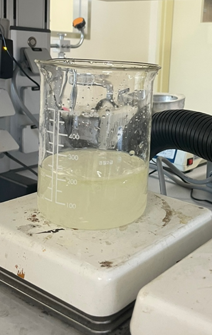
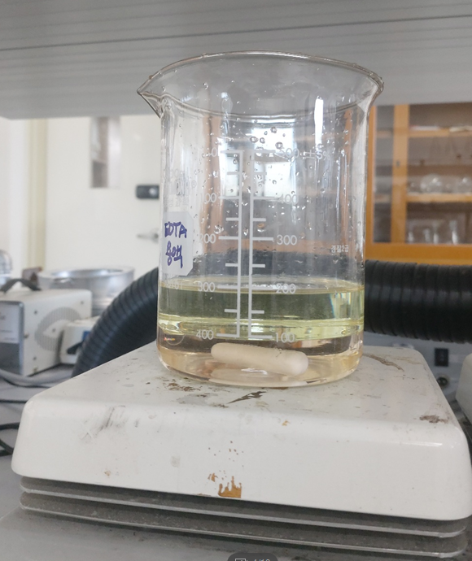
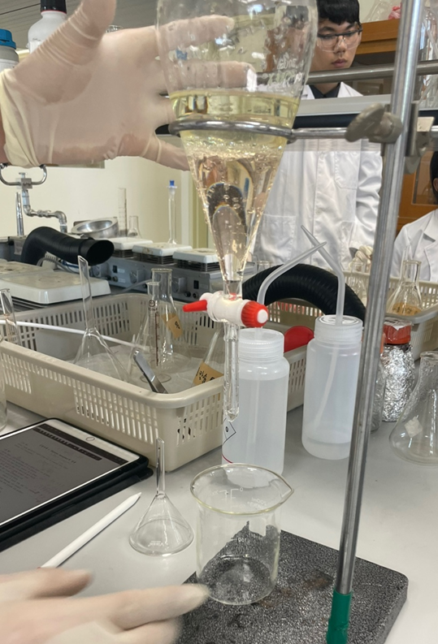
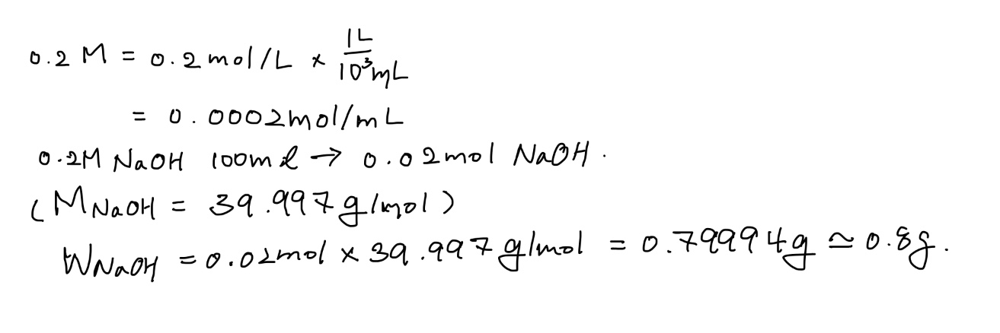

## Styrene monomer 정제

* 192293 탁민경 
* 1분반 6조
* 공동 실험자 
  * 한수경
  * 한태준
* 실험 일자 : 9월 22일
* 제출 일자 : 10월 10일

# 1. 실험 목적

monomer의 저장에는 자연 중합의 진행을 저지하기 위해 금지제가 첨가된다.
물에 녹지 않는 중합금지제를 수용성으로 변화시켜 수용액으로 추축해서 중합금지제를 단량체로부터 제거한다.

# 2. 실험 이론

비닐계 혹은 아크릴계 단량체는 반응성이 높기 때문에 단량체 이송 혹은 보관 중에 외부의 빛이나 열에 의하여 외부의 개시반응 없이 자체적으로 중합이 일어나 단량체를 못 쓰게 되는 경우가 많다
따라서 비닐계 혹은 아크릴계 단량체의 이송 혹은 보관중의 안전성을 위하여 단량체 내에 존재하는 중합금지제를 제거하여야 한다.
중합금지제는 유기액체인 단량체 내에 녹아 있기 때문에 유기용제에 잘 녹고 물에 잘 녹지 않는 특성이 있다.
따라서 물에 녹지 않는 중합금지제를 수용성으로 변화시켜 수용액으로 추축해서 중합금지제를 단량체로부터 제거한다.
단량중 중합금지제로 많이 사용되는 하이드로퀴논을 수산화나트륨 수용액으로 처리하여 물에 용해되도록 한다.
물에 용해된 중합금지제는 유리층인 단량체 층으로부터 수용액 층으로 추출되어 단량체 내에 존재하는 중합금지제가 제거된다.
추출과정에서 단량체 내에 포함되는 수분은 건조제를 이용하여 건조 후 진공 증류하여 최종적으로 정제를 완료한다.

# 3. 실험 과정

<시약>

* styrene
* NaOH
* MgSO4(CaCl2)
* Line type 5A molecular sieve
* 증류수

1. styrene 100ml + NaOH 수용액 100ml 혼합하고 방치한다. 
   
   
2. 아래층인 NaOH 수용액은 버리고 같은 양의 NaOH로 두번 더 반복한다. 
   
3. 염기성을 제거하기 위해 100ml 증류수를 넣어준다. 
4. MgSO4 4g을 넣고 10분 방치한다

# 4. 실험 결과 및 고찰

0.2 M NaOH 수용액 100ml 제조를 위해 필요한  NaOH 질량을 위와 같이 계산하였다. 
 NaOH수용액과 styrene을 섞었을 때styrene에 용해되어 있던 중합금지제가 NaOH수용액에 용해되어 함께 침전되는 것을 볼 수 있다. 

# 5. 참고 문헌

참고 1 : https://patents.google.com/patent/KR100843595B1/ko

