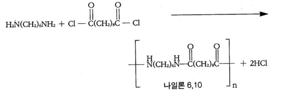
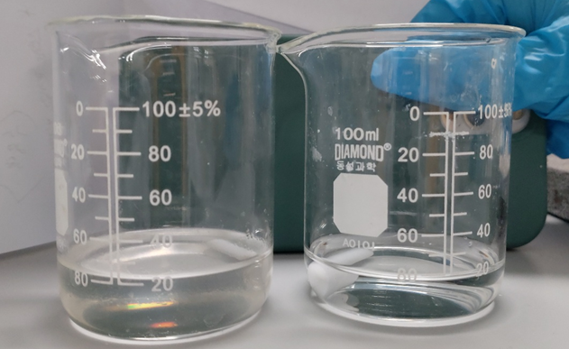
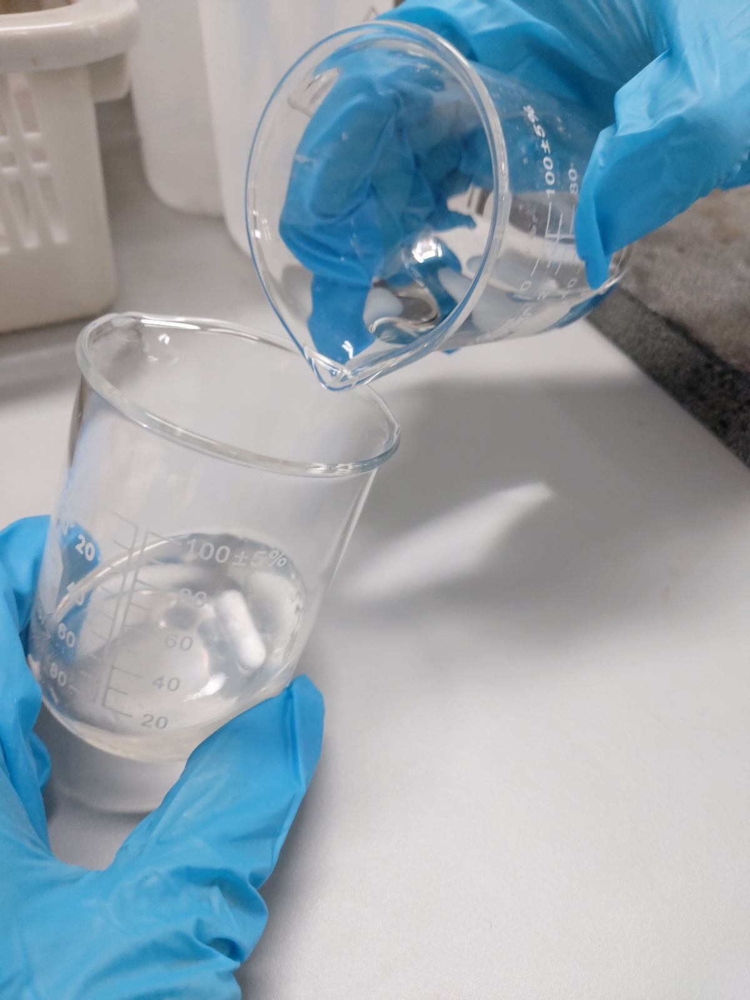
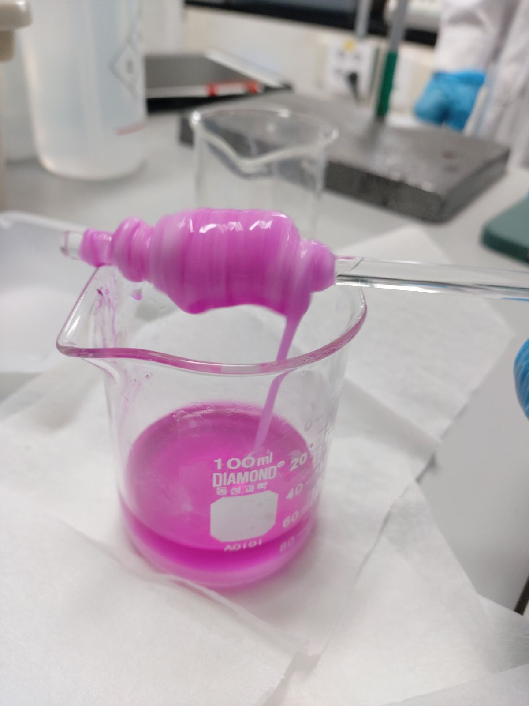
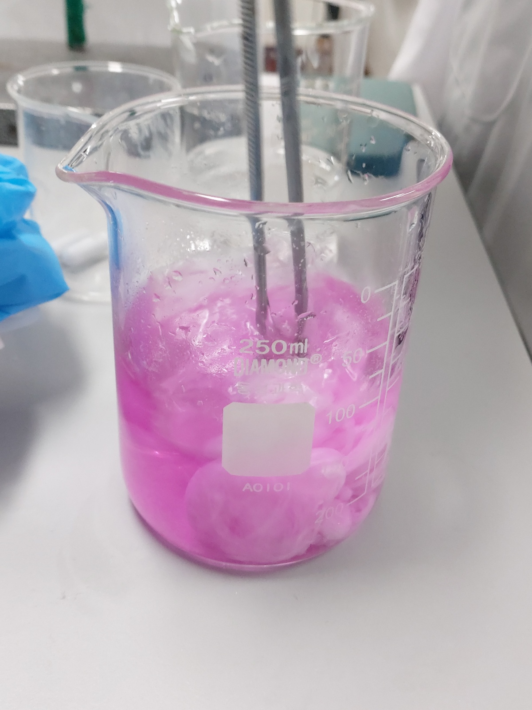
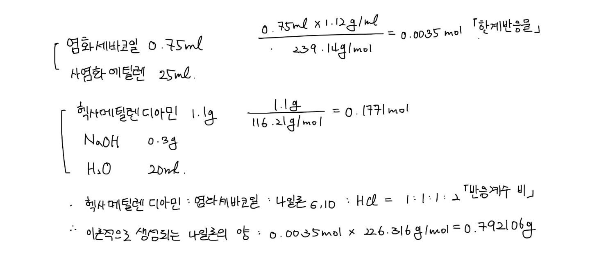
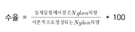

192293 탁민경

## 나일론 중합

* 192293 탁민경 
* 1분반 6조
* 공동 실험자 
  * 한수경
  * 한태준
* 실험 일자 : 10월 6일
* 제출 일자 : 10월 10일

# 1. 실험 목적

나일론을 중합한다. 

# 2. 실험 이론

## 중합체

단위체(monomer)가 반복적으로 모여 중합 과정을 거쳐 분자량이 매우 큰 물질을 형성한다. 이를 보고 고분자(polymer) 혹은 거대분자(macromolecule)라고 한다. 
고분자 혹은 거대분자라고 불리는 이 물질은 매우 많은 수의 원자들이 공유결합을 형성하며 분자 구조를 갖는다. 

하지만 고분자는 모든 분자에 대해서 형성되는 것이 아니다. 
분자의 양 끝에 작용기(functional group)를 갖는 단위체들을 반복적으로 결합하는 중합반응을 통해서 만든다. 

자연에 존재하는 고분자와 비교했을 때 인공적으로 고분자를 합성하면 크기와 모양이 균일하지 않을 수도 있으며 분자량의 형성이 다양할 수 있다. 
이번 실험에서 합성하는 나일론 610도 인공으로 합성하는 중합체다. 그렇기에 합성 상황을 일정하게 유지하지 못한다면 합성되는 나일론이 뭉쳐서 합성될 수도 있으며 중간에 끊어질 수도 있다. 

## 작용기

작용기는 유기 화합물 중 공통된 화학적 반응을 보이는 유기물들이 공통적으로 갖는 원자단을 의미한다. 작용기를 보다 용이하게 표현하려고 하면 시성식을 사용하는 경우가 많다. 또한 유기물의 명명 과정에서도 작용기의 접미어 혹은 접두어를 활용하기도 한다. 이를 보고 유기물이 어떤 작용기를 갖는지 알 수 있으며 화학 반응이 어떻게 발생할 것인지 예측할 수 있다. 

작용기는 탄화수소, 산소를 포함한 작용기, 질소를 포함한 작용기 등 다양한 종류의 작용기가 존재한다. 그 중에서도 고분자 물질을 형성할 때 주요한 반응기와 반응에 대해서 살펴보자.

<table style="border-collapse: collapse; width: 100%;" border="1">
<tbody>
<tr>
<td style="text-align: center;" width="150">

작용기1

</td>
<td style="text-align: center;" width="150">

작용기2

</td>
<td style="text-align: center;" width="150">

반응형식

</td>
<td style="text-align: center;" width="150">

생성되는 결합

</td>
</tr>
<tr>
<td style="text-align: center;" width="150">

-NH2

</td>
<td style="text-align: center;" width="150">

-Cl

</td>
<td style="text-align: center;" width="150">

축합

</td>
<td style="text-align: center;" width="150">

-NH-

</td>
</tr>
<tr>
<td style="text-align: center;" width="150">

-OH

</td>
<td style="text-align: center;" width="150">

-Cl

</td>
<td style="text-align: center;" width="150">

축합

</td>
<td style="text-align: center;" width="150">

-O-

</td>
</tr>
<tr>
<td style="text-align: center;" width="150">

-COOH

</td>
<td style="text-align: center;" width="150">

-OH

</td>
<td style="text-align: center;" width="150">

축합

</td>
<td style="text-align: center;" width="150">

-COO-

</td>
</tr>
<tr>
<td style="text-align: center;" width="150">

-COOH

</td>
<td style="text-align: center;" width="150">

-NH2

</td>
<td style="text-align: center;" width="150">

축합

</td>
<td style="text-align: center;" width="150">

-CONH-

</td>
</tr>
<tr>
<td style="text-align: center;" width="150">

-NCO

</td>
<td style="text-align: center;" width="150">

-OH

</td>
<td style="text-align: center;" width="150">

첨가

</td>
<td style="text-align: center;" width="150">

-NHCOO-

</td>
</tr>
<tr>
<td style="text-align: center;" width="150">

-NCO

</td>
<td style="text-align: center;" width="150">

-NH2

</td>
<td style="text-align: center;" width="150">

첨가

</td>
<td style="text-align: center;" width="150">

-NHCONH-

</td>
</tr>
</tbody>
</table>

## 중합 반응

중합체를 제조하기 위해서 중합 반응이 필요하다.
 하지만 중합 반응은 생성된 고분자의 평균 분자량과 고분자의 생성량 사이의 관계에서 크게 2가지 종류로 구분할 수 있다. 

### 1. 연쇄 중합

연쇄 중합은 새롭게 첨가되는 단위체에 의해서 기존의 복합물이 결합을 바꾸어서 계속 첨가물을 받아들이는 형식으로 중합체를 형성하는 방법이다. 
연쇄 반응에는 첨가 중합반응(addition polymerization)과 개환 중합반응 등이 있다. 

중합체의 확장은 단량체에 해당하는 단위체와 기존에 있던 연쇄담체가 반응하며 일어난다. 하지만 기존의 복합체가 쉽게 반응하는 물질을 넣어준다면 중합체는 확장되지 않는다. 단량체의 농도는 반응을 진행할수록 감소하며 지속해서 분자구조를 바꾸는 형태로 반응이 일어나기 때문에 단량체와 중합체가 항상 혼재되어 있다. 또한 중합체의 확장이 순식간에 발생하므로 반응이 진행되더라도 중합체의 분자량은 변하지 않는다.

### 2. 단계 중합

단계 중합은 단위체 중에서 작용기가 서로 반응하여 중합체를 형성하는 반응이다. 

작용기가 반응하는 반응이기 때문에 형성된 중합체의 양 끝에는 항상 작용기가 남아있다. 
단계 중합에는 중축합, 중첨가, 첨가 축합 등이 존재한다. 
축합 중합은 단위체나 중합체의 작용기끼리 반응하므로 반응이 발생하면 분자량의 크기가 감소한다. 또한 분자량은 반응이 진행됨에 따라 천천히 증가하며 이러한 성질 때문에 단계 중합으로 형성된 중합체를 단계-성장 중합체라고도 부른다. 

## 나일론의 합성

나일론은 합성 방법에 따라 크게 2가지 종류로 구분할 수 있다. 
나일론 xy는 2개의 아미노기를 갖는 다이아민과 2개의 클로로기를 갖는 다이애시드의 축합에 얻을 수 있는 나일론이다. 그리고 나일론 z는 오메가-아미노칼복실릭 애시드의 축합 반응 혹은 랜덤 개환 중합에 의해서 형성된다. 
이때 x,y,z는 나일론 형성을 위해서 사용한 단위체의 탄소 개수를 의미한다. 

이번 실험에서 합성하고자 하는 나일론 6,10은 헥사메틸렌다이아민 염화세바코일의 중합 반응으로 형성된다. 

이번 실험에서 반응하는 작용기에 대해 먼저 살펴보자. 
헥사메틸렌다이아민은 아미노기(-NH2)를 2개 가지고 있다. 그리고 다이클로로메탄은 클로로기(-Cl)을 2개 가지고 있다. 아미노기와 클로로기가 만나면 아미노기의 수소 한 개와 클로로기의 염소가 반응해서 염산을 형성하며 -NH-결합도 형성된다. 이 결합이 형성될 때, 헥사메틸렌다이아민과 염화세바코일이 결합한 단위체가 반복되어 나타나므로 나일론 6,10은 교대 공중합체에 해당한다. 
또한 다이아민(헥사메틸렌다이아민)과 다이애시드(염화세바코일)이 결합하므로 나일론xy에 해당하며 각각의 물질이 포함하는 탄소의 개수가 6개 그리고 10개이기 때문에 나일론 6,10이라고 명명할 수 있다. 이 나일론은 반응기에 대해서 반응하므로 중합 반응 중에서 단계 중합에 해당한다. 이는 고분자 합성의 관점에서 살펴본 것이며 반응의 관점에서 살펴보자면 나일론 6,10은 계면 중합 반응에 의해서 생성된다. 

이번 실험에서 사용하는 액체 시료는 물과 다이클로로메탄이다. 두 액체는 각각 극성과 무극성이기 때문에 섞이지 않으며 밀도의 차이 때문에 각각 위층과 아래층에 위치한다. (실험을 할 때, 밀도가 더 큰 다이클로로메탄 용액을 먼저 넣고 물을 나중에 넣는 방식을 취하는 것이 유리하다.) 

헥사메틸렌다이아민은 물에 잘 용해되며 염화세바코일이 유기용매(다이클로로메탄)에 잘 용해되는 것을 이용하면 두 물질이 물과 다이클롤로메탄의 경계면에서 만나도록 실험을 설계할 수 있다. 이와 같이 다른 극성의 용매를 이용해서 두 용액의 계면에서 중합 반응을 ‘**계면 중합 반응**’이라고 한다. 

계면 중합 반응을 이용하면 반응을 무작위로 진행할 때보다 더 예측 가능한 범위에서 생성물질을 얻을 수 있다. 후에 수득률을 이야기하며 한번 다루겠지만 반응물질의 비율을 정확하게 맞추지 않더라도 얼마나 반응했는지만 정확하게 측정한다면 얼마나 많은 나일론이 생성되며 실제 수득률을 얼마인지 쉽게 구할 수 있다. 

다만, 이번 나일론을 합성할 때는 수산화나트륨(NaOH)을 물 층에 추가해서 반응을 진행해야 한다. 
왜냐하면 나일론 6,10 반응의 부산물로 HCl이 형성되기 때문이다.
 HCl이 독성 물질이기 때문에 중화반응으로 소모하고자 하는 목표도 있다. 
하지만 염산자체가 포함하는 Cl이 클로로기로 작용하여 나일론 합성에 방해요인으로 작용할 수 있기 때문에 중화반응을 통해서 최대한 소거한다. &nbsp;

<table style="border-collapse: collapse; width: 100%;" border="1">
<tbody>
<tr>
<td style="text-align: center;" width="141">

물질 이름

</td>
<td style="text-align: center;" width="85">

화학식

</td>
<td style="text-align: center;" width="113">

화학식량(g/mol)

</td>
<td style="text-align: center;" width="95">

밀도(g/mL)

</td>
<td style="text-align: center;" width="85">

녹는점(℃)

</td>
<td style="text-align: center;" width="82">

끓는점(℃)

</td>
</tr>
<tr>
<td style="text-align: center;" width="141">

헥사메틸렌다이아민

</td>
<td style="text-align: center;" width="85">

C6H16N2

</td>
<td style="text-align: center;" width="113">

116.21

</td>
<td style="text-align: center;" width="95">

0.84

</td>
<td style="text-align: center;" width="85">

42

</td>
<td style="text-align: center;" width="82">

205

</td>
</tr>
<tr>
<td style="text-align: center;" width="141">

염화세바코일

</td>
<td style="text-align: center;" width="85">

C10H16Cl2O2

</td>
<td style="text-align: center;" width="113">

239.14

</td>
<td style="text-align: center;" width="95">

1.12

</td>
<td style="text-align: center;" width="85">

-2.5

</td>
<td style="text-align: center;" width="82">

220

</td>
</tr>
<tr>
<td style="text-align: center;" width="141">

다이클로로메탄

</td>
<td style="text-align: center;" width="85">

CH2Cl2

</td>
<td style="text-align: center;" width="113">

84.14

</td>
<td style="text-align: center;" width="95">

1.33

</td>
<td style="text-align: center;" width="85">

-96.7

</td>
<td style="text-align: center;" width="82">

39.6

</td>
</tr>
<tr>
<td style="text-align: center;" width="141">

아세톤

</td>
<td style="text-align: center;" width="85">

C3H6O

</td>
<td style="text-align: center;" width="113">

58.079

</td>
<td style="text-align: center;" width="95">

1.3588

</td>
<td style="text-align: center;" width="85">

-94.7

</td>
<td style="text-align: center;" width="82">

56.05

</td>
</tr>
<tr>
<td style="text-align: center;" width="141">

수산화나트륨

</td>
<td style="text-align: center;" width="85">

NaOH

</td>
<td style="text-align: center;" width="113">

39.997

</td>
<td style="text-align: center;" width="95">

2.13

</td>
<td style="text-align: center;" width="85">

323

</td>
<td style="text-align: center;" width="82">

1388

</td>
</tr>
</tbody>
</table>

# 3. 실험 과정

1. 0.75ml  sebacoyl chloride 를 25ml 사염화에틸렌(perchloroethlylene)이 들어있는 100ml 비커에 넣는다. 

2. 1.1g의 헥사메틸렌디아민과 0.3g의 NaOH를 20ml의 증류수에 넣는다. 

3. 1,2에서 만든 용액에 stir bar를 넣고 교반기에 5분동안 돌려 잘 섞도록 한다. 
   

4. 교반시킨 후, 1에서 만든 용액에 2에서 만든 용액을 조심히 층이 섞이지 않도로 벽면에 흐르듯이 부어준다. 
   

5. 계면을 보다 뚜렷하게 보기 위해 페놀프탈렌 지시약을 4방울 떨어뜨린다. 

6. 핀셋으로 계면을 조심히 들어올려 유리막대로 돌돌 감으면서 고분자 막을 끌어낸다. 

   

7. 얻은 나일론 6,10을 200ml 비커에 물 (50ml) + 메탄올 (50ml) 용액에 세척 후 다른 200ml 비커의  물 (50ml) + 메탄올 (50ml) 용액에서 한번 더 세척한다. 
   

8. 유리 샬레에 펼쳐두고 3일동안 자연 건조 시킨다. 

# 4. 실험 결과 및 고찰

* 나일론의 수율 측정

  1. 사용된 시약으로부터 생성될 수 있는 나일론의 몰수를 구해준다. 
     

  2. 나일론의 분자량은 226.316g/mol이므로 

     226.315g/mol * 생성될 수 있는 나일론의 몰수 = 생성될 수 있는 나일론의 양

  3. 

     | 이론적으로 생성되는 나일론의 양 | 0.792106g |
     | ------------------------------- | --------- |
     | 실험에서 얻은 나일론의 양       |           |
     | 수율                            |           |

이번 실험에서 나일론을 수득하기 위해서 계면 중합 반응을 이용한다. 나일론이 합성되려면 염화세바코일과 헥사메틸렌다이아민이 서로 반응할 수 있도록 해야 한다. 염화세바코일이 유기용매에 잘 녹는 점과 헥사메틸렌다이아민이 물에 잘 용해되는 점을 이용해서 각각의 용액을 만들었다. 
 두 용액의 계면에서 나일론이 합성된 것을 쉽게 관찰할 수 있었으나 용액이 튀어서 나일론이 막처럼 얇은 형태가 아닌 구름처럼 덩어리진 형상을 관찰할 수 있었다. 

형성된 나일론을 수득하기 위해서 처음에는 핀셋을 이용했다. 하지만 나일론이 기대한 결과인 실처럼 길게 늘어지게 뽑히지 않았으며 덩어리 모양으로 끊기면서 수득됨을 관찰했다. 덩어리진 나일론을 최대한 얻은 후 나일론이 핀셋을 이용해서 수득하기가 어려울 정도로 가루형태밖에 남지 않아서 약숟가락을 이용해서 수득을 계속했다. 

하지만 용기의 면적이 좁아서 사용한 용액의 양에 비해 깊이가 깊었다. 이는 MC 용액과 물 속의 염화 세바코일과 헥사메틸렌다이아민이 형성된 나일론이 계면을 덮어 반응이 다 완결하지 못했을 수 있는 가능성을 갖고 있다. 

나일론을 충분히 세척하지 못하고 건조를 시켰기 때문에 혹시 모르는 불순물들이 같이 건조되어 나일론 질량을 측정할 때 영향을 미쳤을 수 있다. 뿐만 아니라 완벽한 평형상태가 아닌 상황에서의 질량 측정 혹은 용액의 부피 측정 시 올바르지 못한 메니스커스 관찰 및 용액 이동 과정에서의 손실 등도 예상하지 못한 오차를 냈을 수도 있다. 

# 5. 참고 문헌

1. John R.Rumble, CRC Handbook of Chemistry and Physics 85th edition, pp. 3-4, 4-8 ,4-83

2. 대한화학회, 표준 일반화학실험 제 7판, 천문각, 2011, pp. 291~297
