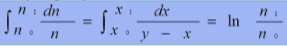

# 단증류

* 192293 탁민경 
* 2분반 4조
* 공동 실험자 
  * 정예진
  * 정태원
  * 최윤영
  * 차미래
  * 최용주
* 실험 일자 : 10월 6일
* 제출 일자 : 

# 1. 실험 목적

* 단증류 실험에 사용되는 실험 도구와 조작법을 익히며, 단증류 실험의 시간의 변화에 따른 유출액 조성을 측정하여 회분 조작의 단증류 원리를 이해한다. 
* 실험 결과와 Rayleigh 식을 이용한 계산 결과를 비교해본다. 

# 2. 이론

## 단증류

* 액체 혼합물을 분리하는 과정 중 하나이다. 
* **단증**이란 물질의 끓는 점을 의미한다. 
  * 물질의 끓는점 차이를 이용하여 액체 혼합물을 분리한다. 
* 과정
  1. 혼합물을 가열하여, b.p가 낮은 물질을 먼저 증발시킨다.
  2. 증발된 물질을 수집한다. 
  3. 수집한 물질을 냉각 과정을 통해 응축 시켜 액화 한다. 

## Rayleigh equation

* 단증류에서 유출량과 잔류액 조성과의 관계를 나타내는 식

  > N_a : 증류기에 남아 있는 끓는점이 낮은 휘발 성분 a의 총 mole수
  >
  > N : 어떤 순간에 증류기에 남아 있는 용액의 mole수
  >
  > x : 끓는 점이 낮은 휘발 성분의 액상 조성
  >
  > * N_a = xN
  >
  > 만약 액체 중 미량dn이 증발했다면 증기 중 휘발 성분 a의 몰 수는 ydn (= d(N_a))이다. 
  >
  > 위 식을 미분하면 
  >
  > * d(N_a) = d(xN) = ndx + xdn = ydn
  >
  > 변수 분리하여 정리면
  >
  > * dn / n = dx / (y - x)
  >
  > 처음에 증류기 안에 있던 액량 N_0 몰로부터, 단증류 후의 증류기 안 액량  N_1일 때
  > 액의 조성 변화인 X_0 부터 x_1까지 적분 하면 
  > 
  >
  > y는 플라스크 내에서 증기가 조금도 분축을 일으키지 않는다고 생각하면, x와 평형인 우변의 적분 항은 x-y곡선이 알려져 있으면 도식적분에 의해 계산된다. 
  >
  > 일정시간 동안 유출되는 양을 D, 평균 조성을 Y_av라 하면,
  >
  > * N_0 - N _1 = D
  > * N_0 * X_0 - N_1 * X_1 = D * Y_av
  >
  > 두 식을 Y_av에 대해 정리하면  유출액의 A성분 평균 몰분율을 구할 수 있다. 
  >
  > 
  >
  > Raoult의 법칙을 만족하는 이상 혼합물일 때, 상대 휘발도(a)는 다음과 같이 정의되며 이를 사용해 Rayleigh식을 간단하게 만들 수 있다.  (i : 휘발도가 더 큰 메탄올, j: 휘발도가 작은 물)
  >
  > 
  >
  >                                                                                                                
  >
  > > 기-액 평형과 상대 휘발도a와의 관계식
  > >
  > > 
  >
  > 위 식을 Rayleigh식에 대입하여 적분하면 다음의 식이 나온다. 
  >
  > 
  >
  > 상대 휘발도 a는 실험 농도 범위에서 평균값을 이용할 수 있으며 온도에 따른 다음의 메탄올-물 계의 기-액 평형 관계 데이터로부터 계산할 수 있다. 
  > 
  >
  > 

  

# 3. 실험 과정

1. 40w% 메탄올 수용액 500ml를 만들어 농도를 측정한 후, 그 중 300ml를 증류기에 넣는다. 
2. 응축기에 충분한 냉각수를 흐르게 한 다음 가열을 시작한다.
3. 원액의 절반이 증류될 때 까지 계속 가열하면서 시간에 따른 온도와 유출액의 양을 기록한다. 
   
4. 증류가 끝나면 잔류액을 냉각시키고, 잔류액과 유출액 전체의 양과 농도를 측정한다. 
   메탄올의 농도는 잔류액과 유출액의 밀도로 구한다. 
   

# 4. 결과

# 5. 고찰

## 1. Rayleigh식의 도식 적분 과정과 결과

## 2. 물질 수지 결과

* 수용액의 양보다 잔류액 + 유출액 양이 더 크게 측정되었는데, 잔류액의 무게를 측정할 때 표면에 있는 수분기가 완전히 제거되지 않은 상태로 무게를 측정하여 오차가 발생한 것으로 보인다. 
* 잔류액과 유출액이 함유한 메탄올의 양이 본디 수용액이 함유한 메탄올보다 적게 특정되었는데, 이는 단증류 중 증류관 틈새나 잔류액이 담겨있던 둥근 바닥 플라스크의 밀봉 틈새로 메탄올이 기화하여 빠져나가 해당 오차가 생긴 것으로 보인다. 

# 6 참고 분헌

참고 1 : https://prezi.com/nknf7p6opmir/5-simple-distillation/
