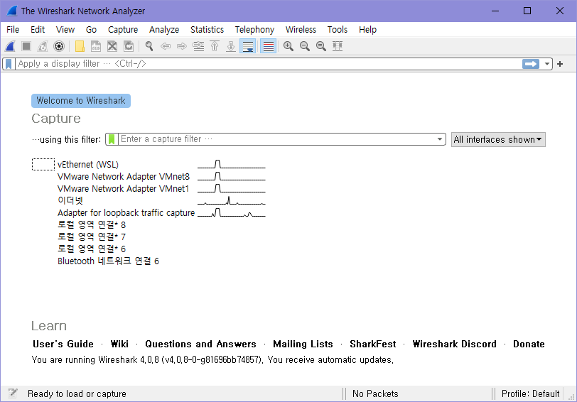
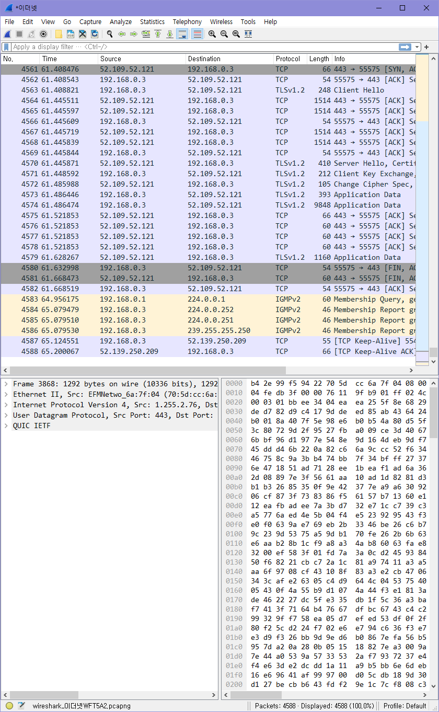
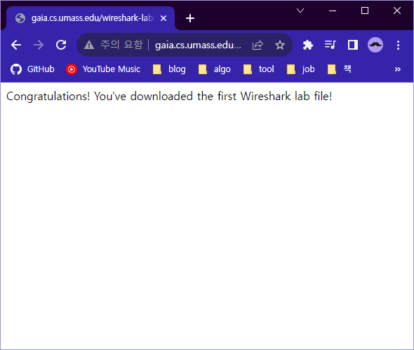
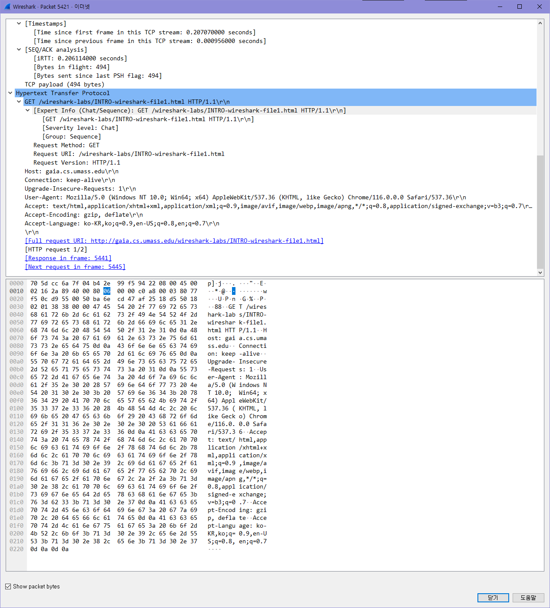
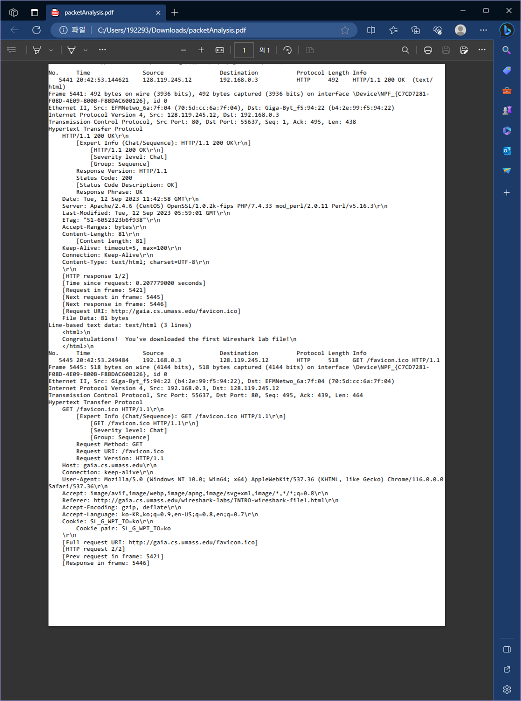

192293 고분자공학과 탁민경

# Wireshark Lab

## 1. 이더넷 인터페이스의 패킷들을 스니핑 해보자

## 2. 다음 url로 서버에 요청을 보내고 응답을 받아 두 패킷을 관찰해보자. 

>   http://gaia.cs.umass.edu/wireshark-labs/INTRO-wireshark-file1.html    

## 3. what to hand in

1.  List 3 different protocols that appear in the protocol column in the unfiltered packet-listing window in step 7 above. 

    ✔TCP, TLSv1.2, IGMPv2 
2.  How long did it take from when the HTTP GET message was sent until the HTTP OK reply was received? (By default, the value of the Time column in the packet-listing window is the amount of time, in seconds, since Wireshark tracing began.  To display the Time field in time-of-day format, select the Wireshark View pull down menu, then select Time Display Format, then select Time-of-day.) 
    ✔20:42:53.144621 - 20:42:52.936842 == 0.20777900000000216 sec
3.  What is the Internet address of the gaia.cs.umass.edu (also known as www¬net.cs.umass.edu)?  What is the Internet address of your computer? 
    ✔나의 주소는 192.168.0.3, gaia.cs의 주소는 128.119.245.12
4.  Print the two HTTP messages (GET and OK) referred to in question 2 above. To do so, select Print from the Wireshark File command menu, and select the “Selected Packet Only” and “Print as displayed” radial buttons, and then click OK. 
    ✔ 

