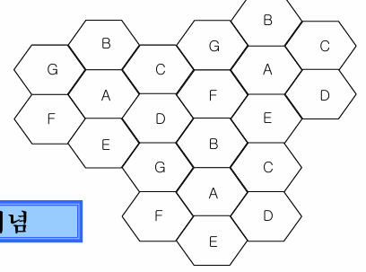
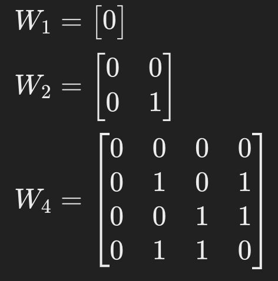
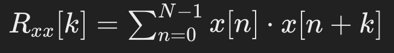

# cell이란?

특정 이동 전화 기지국이 가장 양호하게 전화의 호를 처리할 수 있는 구역

# cell이 모인 것은?

cellular system

# cellular system의 기본 기술 3가지

1. 저출력 다수 기지국으로 통화권을 제공
2. 주파수 재사용을  통해 가입자 용량을 늘림
3. 셀 간 핸드오프가 자동으로 이루어짐

# cellular system은 cluster의 부분집합이다.

ㅗ. cluster 안의 cell들은 모두 다른 주파수를 사용한다. 즉, cluster는 cellular system의 부분집합이다. 

# 주파수 재사용이란

주파수 자원을 효율적으로 사용하기 위해, 동일 주파수를 여러 셀에서 사용하여 가입자 용량을 극대화하는 것.

# 주파수 계획 == 주파수 재사용

맞음

# 다음 클러스터의 크기는?

7개. (셀의 개수)

# 위 셀의 주파수 사용 계수는?

1/7 (1 / 클러스터 크기)

# 위 클러스터에서 각 셀이 10개의 채널을 가지고 있을 때, 가용 총 채널 개수는?

가용 총 채널 개수(S) = 10(각 셀에 할당되는 채널 수) * 7(클러스터 크기)  = 70개

# 총 가용 채널 수가 100개일 때, cluster 수가 4개라면  cellular system의 총용량은?

400

# 셀 사이즈를 유지하면서 클러스터 크기를 줄이면, 더 적은 채널을 사용하게 된다. 

ㅗ. 주파수 재사용 간격이 줄어들어,  더 많은 채널을 사용할 수 있게 된다. 

# 클러스터 크기를 줄이면 셀 당 채널 수는 어떻게 되나?

증가한다. 

# 셀룰러 시스템은 두 개의 25KHz 채널을 이용하고 있고, 총 주파수 대역은 33MHz다.

1. 채널 주파수 대역
   * 25KHz * 2 = 50KHz
2. 총 가용 채널 수
   * 33MHz / 50KHz = 3300 / 5 = 660개
3. 주파수 재사용 개수 = 4 일 때 셀 당 가용 채널 수
   * 660 /4 = 165개
4. 주파수 재사용 계수 = 12 일 때 셀 당 가용 채널 수
   * 660 /12 = 55개

# 1001 개의 무선 채널이 있는 셀룰러시스템에서 셀 당 면적이 6km^2, 전체 시스템 면적이 2100km^2, 클러스터 크기가 7일 때 이 시스템의 총 용량

셀룰러 시스템의 총 용량 = 클러스터 개수 * 클러스터당 셀 개수 * 셀당 채널 수 

셀 개수 = 2100 / 6 = 350개
클러스터 개수 = 셀 개수 / 클러스터 크기 = 50개
클러스터당 셀 개수 = 7
셀당 채널 수 = 총 채널 개수 / 클러스터 크기 = 1001 / 7개 = 143개

50 * 7 * 143 = 50050 채널

# 위 상황에서 전체 시스템 영역의 통화권을 유지하기 위해 N = 4인 클러스터를 사용하면 반복하는 총 클러스터 수와 이 시스템의 용량은? 클러스터 크기가 증가하면 시스템 용량은 증대되나?

총 클러스터 개수 = 셀 개수 / 클러스터 크기 = 350 / 4 = 87.5 = 87개

클러스터당 셀 개수 = 4
셀당 채널 수 = 1001 / 4 = 250.25= 250개

시스템의 용량 = 클러스터 개수 * 클러스터당 셀 개수 * 셀당 채널 수 = 87000채널

클러스터 크기 줄어들면 시스템 용량은 증가한다!

# 클러스터 크기가 7인 경우, 정규화된 동일 채널 셀 간 거리와 실제 거리 그리고 주파수 재사용 비

정규화된 거리: √클러스터 크기 = √7
실제 거리: 정규화된 거리 * R√3 = √7 * R√3
주파수 재사용비: 실제거리 / R = √21

# 주파수 재사용 비가 커질수록 주파수가 한 셀룰러 데이터 내에서 많이 공유되고 있다는 것이다. 

ㅗ. 동일 채널 재사용 비가 커질수록 동일 주파수를 사용하는 셀들이 더 멀리 떨어져 배치되기 때문에 주파수가 별로 공유되지 않는다. 

# 클러스터 크기가 작아지면, 동일 채널 재사용 비가 작아진다. 이 때 통화 품질과 총 총화 용량에 대해 설명하라.

CCI(동일 채널 간섭)이 심해져서 통화 품질이 떨어진다. 

클러스터 크기가 작아지기에 총 클러스터 개수가 증가되고, 따라서 총 통화 용량도 증가한다. 

# 정규화된 동일채널간 거리^2인 √클러스터 크기 를 i, j로 표현해라.

i^2 + j^2 + ij

- 4. 간섭과 시스템 용량

- **동일 채널 간섭(CIC)**: 동일 주파수를 사용하는 셀 간의 간섭을 최소화하기 위해 주파수 재사용 비(Q)를 고려하여 셀 배치를 계획함.
- **간섭 관리**: 클러스터 크기(N)를 조정하여 신호 대 간섭비(S/I)를 최적화함으로써 통화 품질을 유지함. 예를 들어, N=7일 때보다 N=12일 때 S/I 값이 더 크다.

# 셀 간섭 두 종류

1. intra cell interference
2. inter cell interference

# QoS는 무엇의 줄임말인가?

Quality of service

# cellular system에서 SIR = 19dB, 전파 감쇠 계수 = 4

1. 재사용 계수 1/7일 때, 가장 나쁜 경우 SIR

   Q = √(3N) = √21

   SIR = Q^n / N = (√21)^4 / 7 = 63 == 10 * log (63) = 17.99dB 

2. 클러스터 크기가 7일 때 QoS를 만족할 수 있나?그렇지 않다면 클러스터 크기를 얼마로 해야 하고 그 때 SIR은?

   부족하다. 고로 간섭 신호 전력(I)을 더 줄여야 한다. 그러려면 클러스터 크기(N)를 키우면 된다. N = 9일 때 SIR = 81 == 19dB 로 QoS를 넘기게 된다. 

# 신호대 간섭비가 15dB이면 안정된 통화 채널 상태이고, 전파 감쇠 계수가 3일 때 최대 용량을 만족하는 클러스터 크기는?

N = 3,4,7,9,12,13,,

if N = 13, SIR = 18.73dB,
elif N = 12 SIR = 18dB,
elif N = 9 SIR = 15.58dB

클러스터 크기 = 12

# 셀룰러 시스템 용량 증대 방법 3가지

1. **셀 분리(cell splitting)**: 과밀 지역의 셀을 작은 셀로 분할하여 용량 증가.
2. **sectoring**: 지향성 안테나 사용으로 SNR 개선, 주파수 재사용 비 줄여 용량 증대.
3. **micro cell zone**: 여러 존이 하나의 셀로 연결, 고속도로 등에서 효과적.

# cell spliting의 장단점 2가지 씩

장점

* 통화 품질 개선
* cellular system 용량 증가

단점

* hand off 빈번 -> 시스템 복잡성 증가
* 기지국 설치 비용

# sectoring의 원리?

지향성 안테나를 사용하여 하나의 셀을 각기 주파수를 쓰는 여러 개의 섹터로 나눠 
동일 주파수 셀 간의 간섭을 줄여 SIR을 증가시키고 , 
셀의 반경을 유지한 채로 주파수 재사용 비를 줄이는 방법

# micro cell zone이란

많은 트래픽이 발생하는 지역에서 안테나로 여러개의 작은 존을 만들어 주파수 재사용을 극대화해 트래픽을 분산하는 것. 

# micro cell zone은 zone의 중심부에 위치한다.

ㅗ. zone과 cell의 경계부분에 위치

# micro cell zone 내에서는 hand off가 불필요하다. 

맞음.

# repeater란?

기지국의 무선주파수 신호를 원격 지역에 증폭 및 재전송해 재생하는 방식. 

# 지역에서 수용할 수 있는 가입자 총 수를 산출하는데 기반이 되는 이론은?

Trunking theory

# CDMA는 무엇의 약자인가?

code division multiple access

# cdma의 특징 5가지

* 대용량 데이터 전송 가능
* 고품질 서비스 제공
* 뛰어난 보안성
* 저전력 소비
* soft hand off 사용

# muliple access 3가지

- **FDMA**: 주파수 분할 다중접속 방식.
- **TDMA**: 시분할 다중접속 방식.
- **CDMA**: 코드 분할 다중접속 방식.

# user1, user2가 받는 정보를 계산하라.

user1 : (data1 * code1 + data2 *code2) * code 1 = 8

user2 : (data1 * code1 + data2 *code2) * code 2 = -8

# duplex가 뭐야?

양방향으로 통신하는 방식

# FDD에서 guard band가 필요한 이유

uplink와 down link 간의 간섭을 방지

# W1 = [0]일 때, W4는?

# Walsh code의 column은 모두 서로 직교한다. 

ㅗ. row. 유저들도 한 row 씩 코드로 가져간다. 

# walsh code의 한계점 두 가지를 설명하라. 

* code의 길이
  * walsh code는 2의 제곱으로만 늘어난다. 
  * 더 많은 사용자에게 코드를 주려고 코드 길이 늘리다가 각 사용자들이 인코딩한다고 복잡해한다.
* 시간 동기화
  * 시간 동기가 맞지 않으면 직교성이 깨져 cross correlation이 ㅈㄴ 커짐.

# walsh code를 사용하는 이유는?

코드 간의 상호 간섭을 줄여야 디코딩 했을 때 데이터가 제대로 올 거 아니야

# 사용자 A의 코드: [1,1], 사용자 B의 코드: [1,0], 사용자 A의 데이터:[1,−1]사용자 B의 데이터: [1,1] 일 때 userA, userB가 받은 신호를 복원해라.

##### 사용자 A와 B의 신호 생성:

- 사용자 A의 전송 신호: 

  [1,1] x 1 = [1,1]
  [1,1] x -1 = [-1,-1]

* 사용자 B의 전송 신호: 

  [1,0] x 1 = [1,0]
  [1,0] x 1 = [1,0]

##### 합성된 신호:

- 합성된 신호 (동시에 전송): 
  [1,1] + [1,0] = [2,1]
  [-1,-1] + [1,0] = [0,-1]

##### 신호 복원:

- 사용자 A의 복원 신호: 

  [2,1] ⋅ [1,1] = 2+1 = 3
  [0,0] ⋅ [1,1] = [0,0] = 0

  결과: 사용자가 서로 간섭하여 복원 신호가 원래 데이터와 맞지 않게 됩니다.

# 사용자 A의 코드: [1,1], 사용자 B의 코드: [1,-1], 사용자 A의 데이터:[1,−1]사용자 B의 데이터: [1,1] 일 때 userB가  1칩 늦게 도착했다면 이 때 받은 신호를 복원해라. 원래 데이터와 일치하는가?

##### 사용자 A와 B의 신호 생성:

- 사용자 A의 전송 신호: 

  [1,1] x 1 = [1,1]
  [1,1] x -1 = [-1,-1]

* 사용자 B의 전송 신호: 

  [1,-1] x 1 = [1,-1]
  [1,-1] x 1 = [1,-1]

##### 합성된 신호:

- 합성된 신호 (B가 1칩 늦게 도착): 
  [1,1] + [0,1] = [1,2]
  [-1,-1] + [0,1] = [-1,0]

##### 신호 복원:

- 사용자 B의 복원 신호: 

  [1,2] ⋅ [1,-1] = 1-2 = -1
  [-1,0] ⋅ [1,-1] = [-1,0] = -1

  결과: 시간 동기가 깨져 B의 복원된 데이터가 원래 데이터와 불일치 한다. 

# PN code 란

반복되는 패턴을 가진 비트 시퀀스

# pn code의 특징 세가지

1. 균형 특성
   * 한 주기 내에 1, -1의 개수가 거의 동일
2. 상관 특성
   * 자기 상관 값이 특정 지연 시간τ를 제외하고 매우 낮은 값을 가진다. 
3. 런 특성
   * 특정 길이의 연속된 1이나 -1의 개수(런의 길이)가 특정 패턴을 따른다. 

# pn code의 생성 방법을 이야기 해봐라

최대 길이 시퀀스

# 자기 상관 함수를 작성해봐라.

# 자기 상관 값의 특정 3가지

1. τ = 0일 때 항상 최대 값
2. Rxx(τ)=Rxx(−τ)
3. 주기적인 신호의 경우 자기 상관 함수는 신호의 주기와 같은 주기를 가진다. 

# 피드백이란?

쉬프트 하기 전 끄트머리 두개의 레지스터 값으로 xor을 해 쉬프트 후에 땜빵으로 쓰는 것

# 최대 길이 시퀀스로 시드 [1,1,1,1] 을 사용했을 때 maximial length(주기)?

2**4 - 1=  15

# bpsk인 데이터 Bi(t) 를 USERi에게 보내려고 한다. pn code Ci(t)가 다음과 같고, 6chips가 1bit일 때 기지국이 보낸 신호z(t) USER1이 그 신호를 복원해 얻은 B1(t)를 작성하라.

C1(t) = [1, 1, 1, 1, -1, -1, -1, 1, -1, -1, 1, 1, -1, 1, -1]
C2(t) = [1, 1, -1, 1, -1, 1, 1, 1, 1, -1, -1, -1, 1, -1, -1]
C3(t) = [-1, -1, 1, -1, -1, 1, 1, -1, 1, -1, 1, 1, 1, 1, -1]

z(t) = [1 1 1 1 -3 1 1 -3 1 1 1 1 1 -3 1 1 1 -3 1 -3 1 …]

C1(t) * z(t) = [1 1 1 1 3 -1  -1 -3 -1 -1 1 1 …] = (6구간씩 끊어서 합쳐) [6 -4 ..]
B1(t) = 위 값을 1,0 으로 바꿔버리기 [1 0 ..]

# 두 개의 최대 길이 시퀀스의 합으로 생성되며, 상호 상관성이 우수하고 다양한 코드를 제공하는 코드는?

골드 시퀀스

# 대역 확산이란?

통신 시스템에서 데이터를 더 넒은 주파수 대역으로 확산시켜 전송하는 기술이다. 

# 대역 확산의 종류

- **직접 시퀀스 대역 확산**: 신호를 넓은 대역으로 확산시켜 간섭과 잡음을 줄임.
- **주파수 도약 대역 확산**: 신호가 여러 주파수 대역으로 도약하면서 전송되는 방식.

# 대역 확산의 장점

- anti-jam (간섭 제거)
- 사용자 보안(확산코드도 모르는 주제에 복원 어케할래)
- 낮은 도청 확률(니가 이런 대역폭을 상상이나 했을까)
- Rake 수신기로 nultipath diversity benefit 확보

# scrambling?

hide origin data pattern by xor operation

# 순방향 링크에서 각 코드가 하는 역할은?

* walsh code
  * 채널 분류 by orthogonality
  * 직교 확산
* long pn code
  * scrambling
* short pn code
  * cell 분류 especially cell boundary

# 역방향 링크에서 각 코드가 하는 역할은?

* walsh code
  * symbol 분류
* long pn code
  * user 분류 by direct spreading
* short pn code
  * scrambling

# 코드로 cell(기지국) 분류하는 두 가지 방식

* 동기 방식
  * 동일 코드에 시간차
* 비동기 방식
  * 각자 다른 코드 사용

# pn code 동기화 과정

1. 수신기가 송신기의 pn code와 시간적으로 일치하도록 조정 (초기 동기화)
2. 수신기가 송신기와 지속적으로 동기 상태를 유지하도록 조정(tracking)

# 초기 동기화 방식에서 정합필터를 쓰는 방식은 능동형 방식이다.

ㅗ. 수동형 방식이다. 능동형 방식은 co-relator 쓴다.

# tracking할 때 early late 추적기는 corelator로 시간 차이를 조정한다. 

맞음.

# diversity 기술이란?

동일 신호를 서로 독립적인 채널들(서로 다른 주파수들)을 통해 여러번 전송하는 기법

# 전력 제어를 하는 이유?

단말기와의 거리에 따라 간섭 정도가 달라 SNR 의 요구 수준에 안맞기도 해서(near-far problem)

# 어떤 채널이 있나?

- **Pilot Channel**: 이동국에 시간과 위상 정보 제공해서  핸드오프에 쓰게 한다.
- **Sync Channel**: 시스템 동기 및 시스템 파라미터 제공.
- **Paging Channel**: 이동국 호출 및 시스템 구성 파라미터 전송.
- **Traffic Channel**: 실제 사용자의 데이터를 전송. 
- **Access Channel**: call setup, registration by moving new cell, 기지국의 호출에 응답

# diversity 기술 종류 3가지

- **주파수 다이버시티**: 동일 신호를 서로 다른 주파수로 전송하여 결합.
- **시간 다이버시티**: 동일 신호를 서로 다른 시점에서 송신하여 결합.
- **공간 다이버시티**: 다수의 수신 안테나를 통해 수신된 신호를 결합.

#### 8. AMC와 HARQ

- **AMC**: 전파 환경에 따라 변조 방식과 채널 부호화율을 달리 적용.
- **HARQ**: 오류가 발생한 프레임을 재전송하여 성능 향상.

# Pilot channel은 Walsh coder = 0

yes. 기저 대역 정보를 포함하지 않아서. raw data임. 

# AMC (Adaptive Modulation and Coding)?

전파 환경에 따라 변조 방식과 채널 부호화율을 달리 적용하는 방식

# HARQ (Hybrid ARQ)

오류가 발생한 프레임을 버리지 않고 재전송되는 프레임과 결합하여 성능을 향상시키는 방식

# HARQ의 종류 3가지

- **Chase Combining**: 수신 패킷에 오류가 발생하여 재전송했을 때, 이전의 오류 발생 패킷을 버리지 않고 저장했다가 재전송된 패킷과 심볼 대 심볼로 더하여 복조하는 방식입니다.
- **Full IR (Incremental Redundancy)**: 재전송되는 데이터는 새로운 오류 정정 코드와 함께 다시 보내서 이전 패킷과 결합하여 복호수행합니다.
- **Partial IR**:  Full IR 에서 재전송 시 전체 데이터가 아닌 일부 데이터만 재전송에 포함시킨다는 점만 다르다.

# OFDM은 무엇의 줄임말인가?

Orthogonal Frequency Division Multiplexing

# multipath fading?

one digital symbol이 여기저기 부딪혀 서로 다른 딜레이를 가지는 여러 신호의 합으로 수신기에 전달되는 것. 메인 신호보다는 약하지만 수신기에서 메인 신호에 더해지는 순간 심볼의 정체를 파악할 수 없게 되는 ISI가 발생되요.

# 평탄 페이딩이란?

신호의 모든 주파수 성분이 동일한 비율로 감쇠되거나 증폭되는 현상.

# 평탄 페이딩은 언제 겪나요? 주파수 관점과 시간 관점으로 설명해 봐라.

* 시간
  * symbol duration > delay spread
* frequency
  * signal bw < channel bw

# 주파수 선택적 페이딩이란?

여러 경로로 전파되는 신호들이 서로 다른 시간 지연과 함께 수신되어, 
특정 주파수 성분이 다른 주파수 성분보다 더 많이 감쇠되는 현상.

# OFDM이란?

하나의 캐리어를 직교하는 여러 개의  서브 캐리어로 나눠 이를 중첩하여 전송하는 multiplexing 기법.

# OFDM은 주파수 선택적 페이딩에 취약하다.

ㅗ. 각 서브캐리어가 좁은 대역폭을 가지기 때문에 개별적으로 평탄적 페이딩을 겪어, 전체적으로 주파수 선택적 페이딩을 효과적으로 처리할 수 있다. 

# multi carrier modulation 종류 두 가지?

- **주파수 분할 다중화(FDM)**
  - 전체 대역폭을 여러 좁은 서브채널로 나누어 병렬로 전송.

- **스펙트럼 분리**
  - sharp transition 때문에 높은 복잡도
  - ICI 처리하기 쉬움

- **스펙트럼 중첩**
  - 대역폭 효율성과 필터 복잡도 감소를 위해 스펙트럼 중첩
  - 서브 캐리어간 직교성 필요

# OFDM에서 서로 직교하는 서브캐리어로 신호를 만들 때 사용하는 것은?

IFFT와 FFT를 사용하여 신호를 생성합니다.

# 각 서브캐리어가 직교성을 유지하며, 시간 영역에서 신호가 사각형 형태를 가집니다.

맞음.

# Cyclic Prefix(CP)란?

OFDM에서 multipath fading으로 인한 ISI,ICI(간섭) 을 줄이기 위해, OFDM 각 symbol의 끝자락(guard interval)을 복사해 심볼 앞에 붙이는 것. 

# 간섭을 없애려면 delay spread  > guard interval.

ㅗ. delay spread < guard interval

# spectrum을 뭘 위해 shaping 하는데?

주파수 간섭을 줄이고 전송 효율을 높이려고.

# spectrum shaping 종류 중 하나

windowing

# windowing 하면 어떻게 되는데?

OFDM의 symbol 경계에서 주파수의 sharp transition을 부드럽게 만들어 
out of band emission을 줄인다.

# OFDM 장단점

**장점**

- 주파수 선택적 페이딩 채널 처리 용이 (광대역 전송)
- 서브캐리어 중첩 허용으로 스펙트럼 효율적
- IFFT 및 FFT 사용으로 편리한 구현
- MIMO와의 쉬운 결합

**단점**

- 큰 피크-평균 전력 비율 (PAPR) → 더 많은 선형 전력 증폭기 필요
- 긴 심볼 지속 시간 → 주파수 옵셋 및 빠른 페이딩에 취약

# MIMO (Multiple Input Multiple Output)란?

(최대 전송 속도 in proportion to 안테나 개수 하는 = ) spatial multiplexing 기술

# multiplexing?

여러개의 데이터를 하나의 통신 채널을 통해 전송할 수 있게 하는 기술

# 다중 안테나 기술이란?

송신기 또는 수신기, 혹은 양쪽 모두에 다수의 안테나를 사용하고, 발전된 신호 처리 기술을 결합하여 
전송 품질을 향상시키는 기술

# 안테나 간의 간격이 클수록 correlation이 감소한다. 

맞음

# spatial multiplexing 에서는 antenna correlation이 낮아야 한다.

맞음

# 단말기에서 낮은 상관도의 안테나 배치가 어려워서, 비록 수신기 안테나가 하나라도! 송신하는 쪽에서 다중 안테나로 적절히 신호를 보내주면(transmit diversity) multipath fading을 극복할 수 있다.

 맞음.

# receive diversity 기법 중 하나가 STTD이다. 

ㅗ. one of transmit diversity.

# 송신 symbol들을 공간과 시간 상에서 블록을 설정하여 2개의 안테나로 전송하는 방식을 SFRD라고 한다. 

ㅗ. STTD. STBC에서 주파수를 쓴다. 

# beamforming이란?

다중 송신 안테나를 사용해 특정 수신기를 위한 빔을 만들어 수신 SNR을 높이는 것

# 다음 빈 칸에 들어갈 내용은?

SNR이 [A]을 때는 diversity, beam forming으로 ~A, 
SNR이 ~A일 때는 spatial diversity로  데이터 전송 속도 향상.

> 낮을때는

# **MU-MIMO**는 beam forming인가?

ㅗ. spatial diversity이다. 하나의 기지국과 다수의 단말기(단말기 안테나가 하나여도)로 전체 전송 속도를 올린다. 

# **SU-MIMO**는 전체 전송 속도를 올린다.

ㅗ. 단말기의 최대 전송 속도 증가를 목적으로 합니다.

# LTE에서의 down link에서 적용되는 기술은?

- [x] receive diversity
- [x] spatial diversity
- [x] beamforming
- [x] SFBC

# LTE full name

long term evolution

# LTE is 4G.

ㅗ. 4G는 LTE-Advanced

# LTE 주요 특징

1. 확장 가능한 대역폭
2. 최고 데이터 속도
3. 다중접속방식
4. advanced mimo
5. adaptive modulation & coding
6. icic
7. H-ARQ (수신된 신호 결합해 신호 품질 높이고 + 데이터 전송에 오류 생기면 추가 정보 받아서 수정)
8. FDD, TDD 지원
9. mobility -  hard handover “기지국 - 어 내 범위 벗어났네? 끊어 ㅅㄲ”

# ICIC?

inter cell interference coordination. intra- perfect inter - af

# LTE nw archi = ? + ?

기지국 + core network

# LTE vs wcdma

* 구조 : 2단계 vs 3단계
* RAN 기능: 기지국에 몰빵 처리 vs 기지국,기지국 제어기 분산 처리

# 5G 주요 특징

* LTE, RAT 간 이중 연결
* 네트워크 기능 가상화
* network slicing
* 기기 간 직접 통신