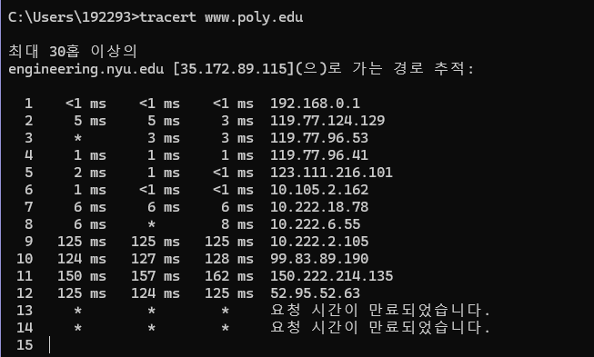

192293 탁민경

1. 

```java
Messages from ATM machine to Server
Msg name					purpose
--------					-------
HELO <userid>				 Let server know that there is a card in the 
							ATM machine
							ATM card transmits user ID to Server
PASSWD <passwd>				  User enters PIN, which is sent to server
BALANCE						 User requests balance
WITHDRAWL <amount>			  User asks to withdraw money
BYE							 user all done

Messages from Server to ATM machine (display)
Msg name					purpose
--------					-------
PASSWD						Ask user for PIN (password)
OK							last requested operation (PASSWD, WITHDRAWL) 
							OK
ERR							last requested operation (PASSWD, WITHDRAWL) 
							in ERROR
AMOUNT <amt>				 sent in response to BALANCE request
BYE							user done, display welcome screen at ATM
    
Correct operation:
client						server
HELO (userid)	--------------> (check if valid userid)
			   <------------- PASSWD
PASSWD <passwd>  --------------> (check password)
			    <------------- OK (password is OK)
BALANCE 	 	 -------------->
				<------------- AMOUNT <amt>
WITHDRAWL <amt>   --------------> check if enough $ to cover 
							    withdrawl
			     <------------- OK
ATM dispenses $
BYE 			-------------->
				<------------- BYE
    
In situation when there's not enough money:
 
HELO (userid) 	--------------> (check if valid userid)
				<------------- PASSWD
PASSWD <passwd>  --------------> (check password)
				<------------- OK (password is OK)
BALANCE 		 -------------->
				<------------- AMOUNT <amt>
WITHDRAWL <amt>   --------------> check if enough $ to cover 
withdrawl
				<------------- ERR (not enough funds)
error msg displayed
no $ given out
BYE 			-------------->
				<------------- BYE

```


2. 

   시간 N*(L/R)에 첫 번째 패킷이 목적지에 도달하고, 두 번째 패킷은 마지막 라우터에 저장되며, 세 번째 패킷은 마지막에서 두 번째 라우터에 저장됩니다. 시간 N*(L/R) + L/R에 두 번째 패킷이 목적지에 도달하고, 세 번째 패킷은 마지막 라우터에 저장됩니다. 이러한 논리를 계속하면, 시간 N*(L/R) + (P-1)*(L/R) = (N+P-1)*(L/R)에 모든 패킷이 목적지에 도달한다는 것을 알 수 있습니다.

3. a) 회선 스위치 네트워크는 이 응용 프로그램에 적합하며, 이는 예측 가능한 부드러운 대역폭 요구 사항을 가진 긴 세션을 포함하고 있기 때문입니다. 전송 속도가 알려져 있고 버스트 형태가 아니므로, 각 응용 프로그램 세션에 대한 대역폭을 중요한 낭비 없이 예약할 수 있습니다. 또한, 연결 설정 및 해제의 오버헤드 비용은 전형적인 응용 프로그램 세션의 긴 지속 시간 동안 저해 상환됩니다.

   b) 최악의 경우, 모든 응용 프로그램이 하나 이상의 네트워크 링크를 통해 동시에 전송합니다. 그러나 각 링크는 모든 응용 프로그램의 데이터 전송률 합을 처리할 충분한 대역폭을 가지고 있으므로 혼잡(거의 큐잉 없음)이 발생하지 않습니다. 이렇게 충분한 링크 용량을 고려하여, 네트워크는 혼잡 제어 메커니즘을 필요로하지 않습니다.

6.

​	a) d_prop = m/s seconds

​	b) d_trans = L/R seconds

​	c) d_end_to_end = (m/s + L/R) seconds

​	d) 이 비트는 지금 호스트 A를 떠나고 있습니다.

​	e) 첫 번째 비트는 현재 링크에 있고, 호스트 B에 도달하지 않았습니다.

​	f) 첫 번째 비트가 호스트 B에 도달했습니다.

​	g) m = L * s / R = 120 ( 2.5 * 10^8) / (56 * 10^3) = 536km

7

한 패킷의 첫 번째 비트를 고려해보겠습니다. 이 비트를 전송하기 전에 패킷의 모든 비트가 생성되어야 합니다.

이를 위해 필요한 시간은 다음과 같습니다:

패킷 생성 시간 = 56 * 8 / (64 * 10^3) [초] = 7 밀리초 (msec)

패킷 전송 시간 = 56 * 8 / (2 * 10^6) [초] = 224 마이크로초 (μsec)

전파 지연 = 10 밀리초 (msec)

디코딩까지의 지연 = 7 밀리초 (msec) + 224 마이크로초 (μsec) + 10 밀리초 (msec) = 17.224 밀리초 (msec)

비슷한 분석을 통해 모든 비트가 17.224 밀리초 (msec)의 지연을 경험한다는 것을 알 수 있습니다.

10

첫 번째 종단 시스템은 패킷을 첫 번째 링크로 전송하는 데 L/R_1이 필요하며, 패킷은 첫 번째 링크를 통해 d_1/s_1로 전파됩니다.

패킷 스위치는 처리 지연인 d_proc를 추가합니다.

패킷을 완전히 수신한 후, 첫 번째와 두 번째 링크를 연결하는 패킷 스위치는 두 번째 링크로 패킷을 전송하는 데 L/R_2가 필요합니다.

패킷은 두 번째 링크를 통해 d_2/s_2로 전파됩니다. 비슷한 방식으로, 두 번째 스위치와 세 번째 링크에서 발생하는 지연인 L/R_3, d_proc 및 d_3/s_3를 찾을 수 있습니다.

이러한 다섯 가지 지연을 더하면 다음과 같습니다.

> d_end-end = L/R_1 + L/R_2 + L/R_3 + d_1/s_1 + d_2/s_2 + d_3/s_3 + d_proc + d_proc

두 번째 질문에 답하기 위해 우리는 단순히 이 방정식에 값을 대입하여 `6 + 6 + 6 + 20 + 16 + 4 + 3 + 3 = 64` 밀리초(msec)를 얻을 수 있습니다.

14

a) 전송 지연은 L / R 입니다.

총 지연은 다음과 같습니다.

IL / R(1 - I) + L / R = L/R/(1 - I)

b) x = L / R 로 놓을 때,

총 지연은 다음과 같습니다.

x/(1 - ax)

x=0 일 때, 총 지연은 0 입니다.

x를 증가시킬수록, x가 1/a로 접근할 때 무한대로 총 지연이 증가합니다.

18

세 가지의 지연 측정값을 얻게 될 것입니다.

이 세 가지 측정값에 대한 평균과 표준 편차를 계산할 수 있습니다.



a) 각각의 세 시간별로 왕복 지연의 평균은 71.18 ms, 71.38 ms 및 71.55 ms입니다. 표준 편차는 각각 0.075 ms, 0.21 ms, 0.05 ms입니다.

b) 이 예에서, 각각의 세 시간마다 경로에는 12개의 라우터가 있습니다. 아니오, 경로는 어느 시간 동안도 변경되지 않았습니다.

c) 출발지에서 목적지까지의 Traceroute 패킷은 네 개의 ISP 네트워크를 통과했습니다. 네, 이 실험에서 가장 큰 지연은 인접한 ISP 간의 피어링 인터페이스에서 발생했습니다.

www.stella-net.net (프랑스)에서 www.poly.edu (미국)로의 Traceroute입니다.

d) 각각의 세 시간별로 왕복 지연의 평균은 87.09 ms, 86.35 ms 및 86.48 ms입니다. 표준 편차는 각각 0.53 ms, 0.18 ms, 0.23 ms입니다. 이 예에서, 각각의 세 시간마다 경로에는 11개의 라우터가 있습니다. 아니오, 경로는 어느 시간 동안도 변경되지 않았습니다. Traceroute 패킷은 출발지에서 목적지까지 세 개의 ISP 네트워크를 통과했습니다. 네, 이 실험에서 가장 큰 지연은 인접한 ISP 간의 피어링 인터페이스에서 발생했습니다.

25

a) 160,000 bits 

b) 160,000 bits 


c) 링크의 대역폭-지연 제품은 링크에 있을 수 있는 최대 비트 수입니다.

d) 비트의 폭은 링크의 길이 / 대역폭-지연 제품이므로 1 비트는 125 미터로 긴 비트입니다. 

e) s/R 

33. F/S 개의 패킷이 있습니다. 각 패킷의 크기는 S=80 비트입니다. 마지막 패킷이 첫 번째 라우터에서 받아지는 시간은 (S + 80) / R * F/S [초]입니다.

    이 시점에서, 처음 F/S-2개의 패킷은 목적지에 도착했고, F/S-1번째 패킷은 두 번째 라우터에 있습니다. 그 후, 마지막 패킷은 첫 번째 라우터와 두 번째 라우터에서 각각 (S + 80) / R [초]가 걸리는 시간 동안 전송되어야 합니다.

    따라서 전체 파일을 보내는 데 걸리는 지연은 delay = (S + 80)/R * (F/S + 2)입니다.

    지연을 최소화하기 위해 S의 값을 계산하려면 다음 미분 식을 사용합니다.

    d (delay) / dS = 0

    이것은 "지연을 S로 미분한 것이 0"을 의미합니다. ➡ √40F