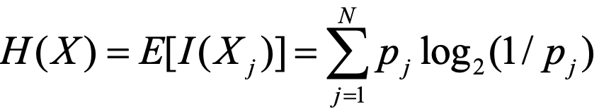
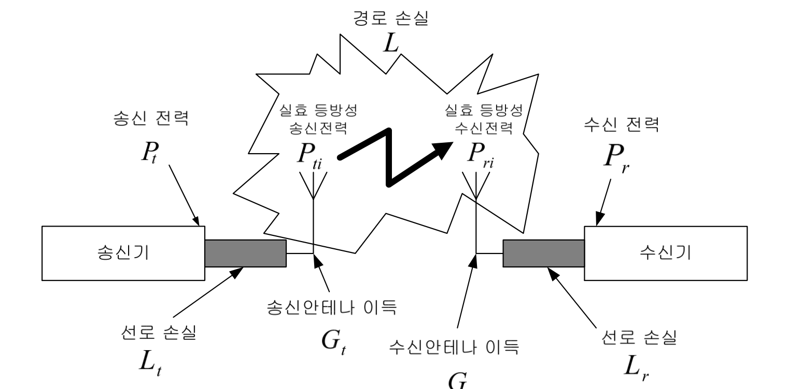

# 신호의 표현 두가지

* analog
* digital

# 다음 빈 자리를 작성하라

| 10^x | 단위  |
| ---- | ----- |
| -3   | mili  |
| -6   | micro |
| -9   | nano  |
| -12  | pico  |
| 3    | kilo  |
| 6    | mega  |
| 9    | giga  |
| 12   | tera  |

# 아날로그 신호?

연속적으로 변하는 전자기파를 나타내는 데이터

# 디지털 신호

전압 펄스(0, 1)의 순서를 나타낸 데이터

# 다음 파동의 위상은?

270°

# 비트 구간(bit interval)?

하나의 비트를 보내기 위해 필요한 시간

# 비트율(bit rate)?

초당 보내어 지는 비트 수

# 비트율의 단위?

bps

# 5bps보다 10bps가 통신 속도가 더 느리다. 

ㅗ. bit rate == 통신 속도

# 다음 이미지에 대해서 비트율과 비트 구간을 구하라

* bit rate: 8bps
* bit interval: 1/8 sec

## digital signal의 장점 4가지

1. 원래의 신호를 복원하기 쉽다.
   * 원래의 신호를 더 정확하게 전달할 수 있다.
2. 신호의 왜곡이나 간섭에 강하다.
   * jamming에 강하다. 
3. 저렴하고 하드웨어로 구현하기 쉽다.
4. 데이터의 처리 & 저장이 쉽다. 

# jamming이란?

통신에서 타인이 사용자의 신호에 고의로 들어와 발행하는 신호를 섞는 것

## 디지털 신호의 단점

* 기술적으로 더 복잡
* 신호를 처리하는데 몇 단계 더 필요하다
* 동일한 정보 대비 아날로그보다 필요한 대역폭이 더 크다
* 동기화 과정이 필요하다

# 통신에서 데이터의 시작점을 맞추는 과정을 뭐라고 하는가?

동기화

# 0Hz 진폭 5인 직류의 시간-진폭 , 주파수-진폭 그래프를 작성하라

# 8Hz 진폭 5인 교류의 시간-진폭 , 주파수-진폭 그래프를 작성하라

# 주파수 스펙트럼(spectrum)?

주파수 영역(domain)에서 신호를 구성하는 주파수 성분

# 신호의 대역폭(bandwidth)?

* 최고 주파수와 최저 주파수의 차. 
* 주파수 sepctrum의 폭

# 하나의 신호로 신호 강도를 측정할 수 있다. 

ㅗ. 두 신호 간의 상대적 크기로 밖에 측정이 안된다.

# 신호 강도 측정의 단위와 수식

P: 신호의 강도(에너지)

# 내가 듣기에 소리가 40배는 커진 것 같다. 신호의 강도는 얼마나 커진걸까?

40dB = 10 * log_10 (x)

x = 10 ^ 4배 커진거다.

# log2 = ?

0.3

# 전압이 0.1v -> 5v 증가했다.신호 강도는?

34dB

# 전압이 0.1v <- 5v 증가했다.신호 강도는?

-34 dB

# 전압이 변하지 않았을 때 신호 강도는 0보다 크다. 

ㅗ. 0이다. 

# 전력이 2배 증가했다. 신호 강도는?

10log2 = 3dB

# 현재 3dB이다. 현재 전력과 전압은 각각 몇배 증가한 것인가?

* 전력: 2배
* 전압: 1.414배

# 현재 -3dB이다.현재 전력과 전압은 각각 몇배 증가한 것인가?

* 전력: 1/2배
* 전압: 0.707배

# 현재 10dB이다.현재 전력과 전압은 각각 몇배 증가한 것인가?

* 전력: 10배
* 전압: √10배

# 현재 -10dB이다.현재 전력과 전압은 각각 몇배 증가한 것인가?

* 전력: 1/10배
* 전압: √1/10배

# 현재 6dB. 전력과 전압은 각각 몇배 증가한 것인가?

* 전력: 4배
* 전압: 2배

# 현재 -6dB. 전력과 전압은 각각 몇배 증가한 것인가?

* 전력: 1/4배
* 전압: 1/2배

# 신호가 13dB 증폭해 1.2W를 나타내었다. 원래 신호 값은?

1.2 / 10^1.3

# 0.2W 신호가 회로를 통과한 후 22dB의 이득을 가졌다면 최종 전력 값은?

0.2 * 10^2.2

# 현재 13dB. 전력과 전압은 각각 몇배 증가한 것인가?

* 전력: (10 * 2 )배
* 전압: √20배

# 현재 36dB. 전력과 전압은 각각 몇배 증가한 것인가?

* 전력: (10^3 * 2^2 )배
* 전압: √4000배

# 현재 7dB. 전력과 전압은 각각 몇배 증가한 것인가?

* 전력: (10 / 2 )배
* 전압: √5배

# 현재 46dB. 전력과 전압은 각각 몇배 증가한 것인가?

* 전력: (10^4 * 2^2 )배
* 전압: 200배

# 현재 34dB. 전력과 전압은 각각 몇배 증가한 것인가?

* 전력: 10^4 / 2 ^ 2 배
* 전압: 50배

# 신호의 절대 강도?

처음 전력 혹은 전압을 1mW || 1W , 1V로 고정했을 때 신호 강도

# 0dBW는 ?dBm

30 dBm

# sigA 40dBm, sigB 2dBW, sigA의 강도 about sigB

sigB: 2 + 30 dBm

40 / 32

# 200mW의 dBm?

23dBm

# 오디오 앰플의 출력이 7dBW라면 그 전력 값은?

10^0.7W

# 신호 값이 8.2V를 dBV로 나타내라

20log8.2

# 정보량?

어떤 사건(P_i)이 일어날 수 있는 확률의 역수

1/P_i

## 자기 정보량 I(X)?

I(X-i) = log(정보량) [bits]

## 평균 자기 정보량 (엔트로피)

# 26자로 구성되는 알파벳의 엔트로피는?

# 어느 영자신문에서 알파벳의 숫자를 조사하였더니 모두 같은 확률로 발생되지 않고 알파벳마다 차지하는 비율이 다르다고 한다. a, e, o, t는 0.1의 확률로 나타나고, h, i, n, r, s는 0.07, c, d, f, l, m p, u, y는 0.02, b, g, j, k, q v, w, x, z는 0.01의 확률로 나타난다고 한다. 이 경우 알파벳 중 한 문자가 쓰여졌을 때 언어지는 엔트로피는 얼마나 되는가?

4 * 0.1 * log_2(0.1) + 5 * 0.07 * log_2(0.07) + 8 * 0.02 * log_2(0.02) + 9 * 0.01 * log_2(0.01)

# 유선 매체 3종류

* 이중 나선
* 동축 케이블
* 광섬유

# 무선 대역 ehf, shf, uhf, vhf, vlf, usf, slf, elf 를 진동수가 작은 순서대로 나열하라

* 극단적인 순서: ESUV
* elf, slf, usf, vlf, vhf, uhf, shf, ehf

# transmission impairment(전송 손상) 의 종류 3가지

* attenuation(감쇠)
* distortion(왜곡)
* noise(잡음)

# attenuation의 원인과 해결방법은?

신호가 매체를 타고 이동하는 중 발생하는 에너지 손실

중간에 증폭기나 repeater 사용

# repeater란?

신호를 증폭해서 재전송 하는 장치.

# distortion의 원인?

다양한 주파수로 구성된 전파를 동시에 쐈는데, 반사와 회절로 인해 주파수 마다 각자 다른 시점에 도착해버림.

# SNR = ?

SNR = signal power / noise power

# SNR 이 클수록 오류율( BER)은 작아진다.

맞음

# thermal noise의 원인?

자유 전자들의 불규칙한 움직임.

# 자유 전자로 인한 전력은 모든 주파수 영역에 균일하다. 고로 black noise라고도 불린다.

ㅗ. white nosie

# 열잡음 N_0 = ?

N_0= kT [W/Hz]

> k = 1.3803 * 10^-23 J/K

# 17℃에서 열 잡음[dBW/Hz]은?

N_0 = 1.3803 * 10 ^ -23 * (273 + 17) = 4 * 10 ^-21 W/Hz = 10log(4 * 10 ^-21) dBW/Hz = -204 dBW/Hz = (-204 + 30) dBm / Hz

# 주파수 대역폭이 B Hz일 때 열 잡음 전력

N = N_0 * B

# 17℃, 사용 대역폭이 1.23MHz인 CDMA의 총 열 잡음 전력

N = log(1.23 * 10 ^ 6 * 1.3803 * 10^-23 * (273 + 17)) dBW

# 전화 중 다른 사람의 말이 들리는 것을 뭐라고 하는가? 원인은?

crosstalk

차폐가 안된 동선 가닥이 인접해 있거나, 안테나로 신호를 수신할 때 반사된 신호까지 같이 수신되어 버린 경우

# 번개나 통신 장비의 결함 등으로 인한 잡음을 뭐라고 하나?

impulsice noise

# 오류 비트를 영어로 뭐라고 하나?

bits in error

# channel capacity (**C**) = ?

주어진 통신 환경에서, 이상적으로 오류 없이 데이터를 전송할 수 있는 최대의 전송속도[bps]

C = B * log_2 (1 + SNR)

> B: bandwidth

## E_b / N_0 = ?

E_b / N_0 = SNR * bandwidth * bit rate

# E_b / N_0 가 증가하면  BER 은 감소한다.

맞음. E_b / N_0  = SNR * bandwidth * bit rate인데 SNR이 증가할수록  BER은 감소하니까

+ 

# formatting이란?

아날로그 신호를 디지털 신호로 변환 by sampling + quantization + encoding

# source coding?

formatting에서 얻은 디지털 데이터를 압축하면서 불필요한 데이터 버림

# source coding 다음 단계가 무엇인지 설명하라

encryption은 권한이 없는 사용자가 메시지를 이해 +  잘못된 메시지 주입을 막는다. 

# channel coding

정보의 전송 중에 발생하는 에러를 검출 + 정정할 수 있게 신호 변환

# 에러 종류 2가지

* random error
* burst error

# burst error를 random error로 변형시키는 기법은?

interleaving

# 데이터‘ABCD’를 interleaving하라

ABCDABCDABCD

# 변조되지 않은 정보를 가진 신호는?

base band signal

# base band signal의 center frequency?

0

# 신호 전송 거리가 길고, 잡음의 영향이 적은 높은 주파수의 신호는?

carrier(반송파)

# 아날로그 신호 modulate 방법 3가지

* AM(amplitude modulation)
* FM(frequency modulation)
* PM(phase modulation)

# 다음 신호의 변조 방식은?

PM

# 디지털 신호 modulate 방법 3가지

* ASK (amplitude shift keying)
* FSK (frequency shift keying)
* PSK (phase shift keying)
* QPSK(Quadrature PSK)
* QAM(Quadrature Amplitude Modulation)

# 디지털 데이터 ‘101’을 PSK해라

# 다음 변조 방식은?

QPSK

# 다중화(multiplexing)?

하나의 통신로에 여러 신호를 동시에 송수신 할 수 있게 만드는 기술

# 역다중화(demultiplexing)

하나의 통신로로 오는 결합된 다중 신호를 분리하는 기술

# 다중화 종류

* FDM(frequency division multiplexing)
* TDM(time division multiplexing)
* WDM(wave division multiplexing)

# 다중 접속(multiple access)?

자원을 여러 사용자가 공동으로 사용하는 기술

# 다중접속 종류

* FDMA(frequency division multiple access)
* TDMA(time division multiple access)
* CDMA(code division multiple access)

# CDMA란?

여러 사용자가 동일한 주파수를 동시에 사용하되, 송수신에서 동일한 코드를 사용하는 통화면 골라서 들음

---

# 전파?

매체 없이 전달되는 3THz이하의 전자파

# TEM이 뭔가?

전자기파

# 파장이 4m일 때 가능한 안테나의 길이는?

2m, 1m

# 전파의 속도는?

3 * 10^8 m/s

# 전파의 특성 6가지

* 직진성
* 반사성
* 굴절성
* 간섭성
* 회절성
* 전반사성

# 등방형 방사기란?

모든 방향으로 동일한 전력을 방사하는 안테나

# 등방형 방사기로부터 d 떨어진 수신기에서 전력 밀도(power density)

# 송신 전력 100W의 등방향 방사기가 신호를 방사했을 때, 10Km떨어진 지점에서의 전력 밀도?

P10km = 100W / 4* pi * 10^3*2 W / m^2

# 실제전파 환경에서 송신 안테나 이득(Gt)

P_da = 실제 전력 밀도

P_di = 등방향 방사기 기준 전력밀도

# 수신 전력 밀도 power density = ?

# EIRP란?

최대 송신 전력

# 송신기는 5dBi의 이득을 가진 안테나를 쓰고 있다. 송신 전력이 100W일 때 10km거리에서 EIRP와 전력 밀도는?

5dB = 10 log Gt → Gt = √10 = 3.16

EIRP = PtGt = 100W * 3.16 = 316W

Pd = EIRP / (4 * pi * 10^4) W/m^2

# 전자장 강도 (𝛆)

𝛆 = √(30EIRP) / d

# source로부터 위와 같은 신호에 대해 10km에서 전자장 강도는?

𝛆 = √30 * 316 / 10^4 V / m

# notation이 다음과 같을 때, 수신 전력과 path loss?

#  RF 전송 시스템의 구성을 순서대로 작성하라. 

DSP, mixer + osc, amplifierm mixer + osc, filter, 고출력 증폭기(hpa), 안테나

안테나, 저잡음 증폭기(lna), filter, mixer + osc, filter, amplifier, mixer + osc, filter

# 사람의 음성이 3000Hz일 때 안테나의 길이는?

파장 = 3 * 10^8 / 3 * 10^3 = 10 ^ 5

안테나 길이 = 파장 / 2

# 무지향성 안테나 종류 2가지

* 수직 안테나
* GP 안테나

# 지향성 안테나 종류 3가지

* 8자 지향성 안테나
* 단일 지향성 안테나
  * yagi uda
  * parabola
  * quad

# 지향성 안테나는 전후방비가 클수록 좋다.

맞음.

# 반치각이 작을수록 인접 안테나로부터 간섭이 줄어든다. 

맞음.

# 전치 보상 회로로 인해 고출력 증폭기는 선형적이다.

ㅗ. 비선형적이다. 

---

# 이동 통신 채널의 특성 4가지

* 경로 손실
* shadowing
* fading
* interference

# 송신기로부터 통화권을 추정하는데 사용되는 전파 모델은?

large scale propagation model

# large scale propagation model에서 감쇠 요인 2가지

* path loss
* shadowing

# shadowing에 의해 신호의 변화는 급격하게 일어난다. 

ㅗ. 천천히 일어난다.

# fading의 원인

* 다중 경로로 수신되는 신호
* 이동 속도에 따른 도플러 shift

# 다중경로에 대한 delay spread?

송신된 전파가 다중 경로 전파환경에 의해 산란 및 반사되어 수신 시간이 퍼지는 현상

# 경로가 길어질수록 delay spread도 길어지고 fading은 심해진다.

맞음.

# ISI?

inter symbol interference

# 저속 데이터 전송일수록 ISI증가

ㅗ. 고속 데이터 전송일수록

# delay spread가 길어지면 coherence band width는 줄어드니까 fading도 크다.

맞음.

# signal bandwith < channel bandwidth

최악. flat fading이다. 

# 지연 시간 < symbol 주기 이라면 frequency selective fading이다.

ㅗ. flat fading이다. 

# doppler shift?

이동체 속도에 따라 주파수가 변하는 현상

# 도플러 효과로 인한 Fd = ?

# fade 간 시간 간격

# 원인에 따른 small scale fading의 종류

* 다중 경로 지연 확산
  * flat fading
  * frequency selective fading
* doppler shift
  * fast fading
  * slow fading

# fast fading은 doppler shift가 증가하는 경우다. 

맞음

# coherence time > symbol 주기 인 경우는 fast fading이다. 

ㅗ. slow fading

# cdma-2000 과 달리 wcdma는 동기 방식이다. 

ㅗ. 비동기 방식이다. 

# 이동 통신 시스템의 구성

*  무선 통신 sys
  * 안테나
  * 송수신기
  * 송수신기 컨트롤러
* 교환 sys
* 위치 등록 장치
* 프로세싱 센터
* 외부 nw

# 무선 데이터 서비스 시스템 2가지 종류

* 회선 데이터 서비스
* 패킷 데이터 서비스

# roaming이란?

지역, 국경을 초월해 어디서나 통화할 수 있는 것.

# 서로 다른 이동국이 주파수를 공유하는 형태로 hand off를 하는 형태를 hard hand off라고 한다.

ㅗ. soft hand off

# 

