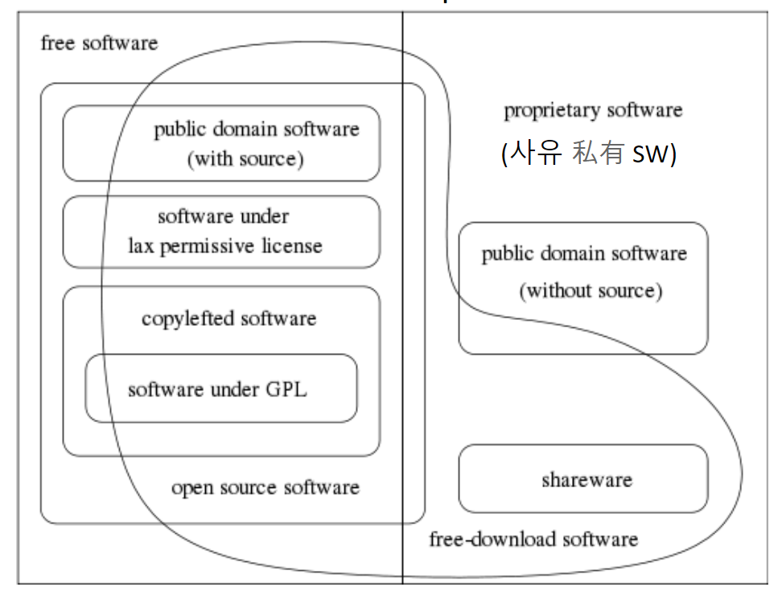

# introduction to open source software

## open source software(OSS)

저작권 주인이 인류에게 게시, 사용, 복사 , 수정, 배포를 허락한 소프트웨어

## OSS License

OSS의 사용 범위

### 공통점

* 저작권 관련 문구 유지
* 제품명 중복 방지

### OSS  종류 (차이점)

* 사용 여부 명시
* 소스 코드 공개
* 특허권 관련

| License               | 코드 공개 안해도 되지? | 니꺼 수정했는데 까야되? | 특허야?(=쓸때 돈 내야되?) | 설명                             |
| --------------------- | ---------------------- | ----------------------- | ------------------------- | -------------------------------- |
| GPL 2.                | N                      | Y                       | N                         | #바이러스 효과                   |
| LGPL                  | Y                      | Y                       | N                         | #Lesser GPL                      |
| MIT, BSD              | Y                      | N                       | N                         | #보증 없음                       |
| Apache 2., MPL 1./1.1 | Y                      | Y                       | Y                         | #첫 상용 오픈 라이센스#보증 없음 |
| GPL 3.                | N                      | Y                       | Y                         |                                  |

## 상용화 관점

⚡️**Commercial SW** VS **Open Source SW**⚡️

* Commercial SW
  * Individual License → 일일이 허락 받으셈
  * Royalty → 로열티 달달하고
  * Binary Only → 소스 공개 어림도 없지
  * No reproduction, distribution, modification → 복제, 배포, 수정 ㄴㄴ
  * limited terms and purpose → 사용 시간 이랑 용도 변경 ㄴㄴ
* Open source SW
  * open source License → 귀찮으니까 허락 받으러 오지 말고 
  * No royalty → 공짜임
  * Source code → 마 이게 코드다. 
  * Reproduction, distribution, modification allowed → 한번 이것저것 

😎 commercial 이든 open이든 intellectual property rights의 보호를 받아!

## 철학적 관점

⚡️**Free SW** VS **Open Source SW**⚡️

➡ 어떤 사유 sw는 open source sw지만, 그 누구도 free sw는 아니다.

## ⚡️Free SW  VS  Open Source SW⚡️

| Free SW                        | Open Source SW                                               |
| ------------------------------ | ------------------------------------------------------------ |
| Copyleft(No SW patent, No DRM) | 공짜로 쓸 순 있지만 법적 책임이 따른다.(Patent) 공개 sw +  비공개 sw 인정해! ➡DRM 필요하지 |
| 사용 범위 그딴거 없이 다 오픈  | 그래도 사용 범위가 있다.                                     |

**DRM : 보호 관리하는 기술**

| copyright    | copyleft    |
| ------------ | ----------- |
| #소유#보수적 | # 공유#혁신 |

> **SW 지적 재산권(intellectual propriety right)**
>
> |                            | 저작권                | 특허권         |
> | -------------------------- | --------------------- | -------------- |
> | 등록 절차 필요해?          | N. 탄생과 동시에 발생 | Y. 출원 해야지 |
> | 쓰려면 주인 허락 받아야해? | Y                     | Y              |
>
> **주인 허락 : license**
