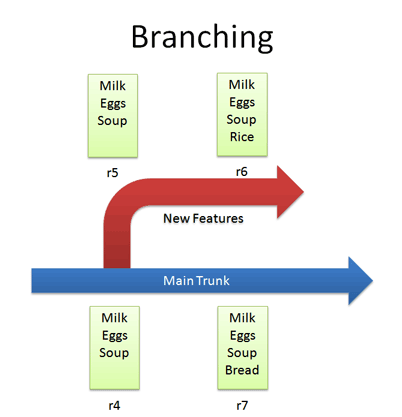

> Introduction  to version control system!!!

# VCS가 없다면..?

파일 이름으로 웃긴 핸드 메이드 버전관리를 해야 함.
다른 사람들에게 파일 직접 전송해주면서 프로젝트의 버전을 관리해야 한다. 

> ex. 최종.md, 최최종.md

# VCS(version control system)

* 시간에 따른 파일의 내용을 트래킹한다. 
* 이전 버전을 쉽게 다운로드 받을 수 있다. 

# VCS sw

* CVS (concurrent version system)
* SVN(subversion)
* Mercurial
* Darcs
* Git
* etc...

# Repository

버전 관리에 관련된 데이터들이 저장된 저장소

# General Actions in VCS

## checkin

* 작업한 것을 repository에 넣기

| VCS  | cmd     |
| ---- | ------- |
| Git  | commit  |
| SVN  | checkin |

## checkout

* repository에서 working directory로 가져오기

| VCS  | cmd          |
| ---- | ------------ |
| Git  | fetch / pull |
| SVN  | checkout     |

## Diffs

* 여러 버전 간 차이점 비교

| VCS  | cmd  |
| ---- | ---- |
| Git  | diff |

## Branching

* 신규 기능 개발을 위해 코드를 복사해와서 별도의 history로 tracking되게 하기

## merging

* 기능 개발 후 합치기

  

  R8은 
  R7의 Bread + R6의 Rice가 더해졌다. 

## conflicts

# 퀴즈

1. git commit 에 대한 설명 중 가장 적합한 것을 선택하시오.

- [x] 작업한 파일을 주 branch에 올리기
- [ ] 주 branch에서 작업한 파일을 내려받기
- [ ] 주 branch에서 새로운 branch로 갈라치기
- [ ] 갈라진 branch를 주 branch와 합하기

2. 분산 버전 제어 시스템을 모두 선택하시오

- [ ] CVS
- [ ] Darcs
- [x] Git
- [x] Mercurial
- [ ] SVN

1. 다음 커밋 대상이 되는 파일들을 가리키는 것을 다음 예시 중에 선택하시오

- [ ] Workspace
- [x] Index(Stage)
- [ ] Local Repository
- [ ] Remote Repository

3.다음 Git명령어 중에서 네트워크를 이용하지 않는 명령어는 무엇인가?

- [ ] git clone
- [x] git commit
- [ ] git push
- [ ] git fetch

4. fork와 pull request로 인한 버전 정보 이동에 대한 설명으로 적합한 것을 선택하시오.

- [ ] 지역 저장소 →지역 저장소
- [ ] 지역 저장소 →원격 저장소
- [ ] 원격 저장소 →지역 저장소
- [x] 원격 저장소 →지역 저장소