# polymer and composite materials processing

* polymer에 additves 넣는 이유가 뭐야?
  1. material의 properties를 바꾸기 위해
  2. polymer의 degradation(분해)를 막기 위해

* additives의 목적 2가지

  1. modifying
  2. protective

* modifying additives에 대한 설명으로 올바르지 않은 것을  수정하라

  - [ ] reinforcing filler는 polymer를 toughen 하고 값을 더 저렴하게 한다.
  - [ ] non reinforcing fillers는 powder 형태이며 polymer 를 stiffen한다.
  - [ ] 유연하게 만드려면  plasticizer를 안쓰면 된다.
  - [ ] liquid rubber에서 extender로 활약
  - [ ] vulcanization으로 고무에 가교를 만들면 탄성이 구려진다.
  - [ ] foamed product. 만드는 Additives를 chemical blewing agent라 부른다.

  * 값을 저렴하게 하는 것은 non reinforcing filler || extenders
  * ㅇㅇ
  * ㅗ. plasticizer는 softener다. 
  * ㅇㅇㅇ
  * 탄성이 좋아진다.
  * chemical blowing agent라 부른다.

* protective additives의 사례중 틀린 것은?

  1. antioxidant
  2. dying
  3. heat stabilizer
  4. antiozonants
  5. antistatic agents
  6. processing lubricants(쉽게 만드는거

* polymer mix의 form

  * large bale of solid rubber
  * granule
  * liquid medium molecular weight resin(고분자 시드)
  * latex (고분자가 emulsion된거. emulsion은 물과 기름이 균일하게 섞인거)

* additives가 뭐든 polymer mix의 form follows polymer

  * ㅗ. vice versa

* mixing process type을 구분하는 기준은?

  * shear force가 센지 아닌지

* 고체를 가볍게 섞는 것은 intensive, dispersive mixing or compounding process다. 

  * ㅗ. extensive, distributive mixing or blending이다. 쟤네는 molten or rubbery state인걸 개빡세게 섞는다. 

* (a) 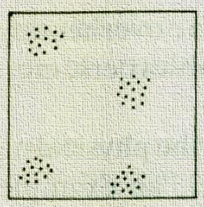(b)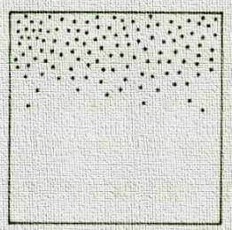

  구린 distribute과 좋은 disperse를 가진 것은 무엇인가?

  * (b). 반대로 (a)는 distribute은 좋지만 disperse는 구리다. 
  * (a) distribute 👍 (b)dispersive👍
  * distribute은 손으로 찢기, dispersive는 갈기

* crazy amout of  modifying ingredient mixing needs distributive mixing

  * ㅗ. dispersive mixing

* 다음 중 high shear force ??

  1. 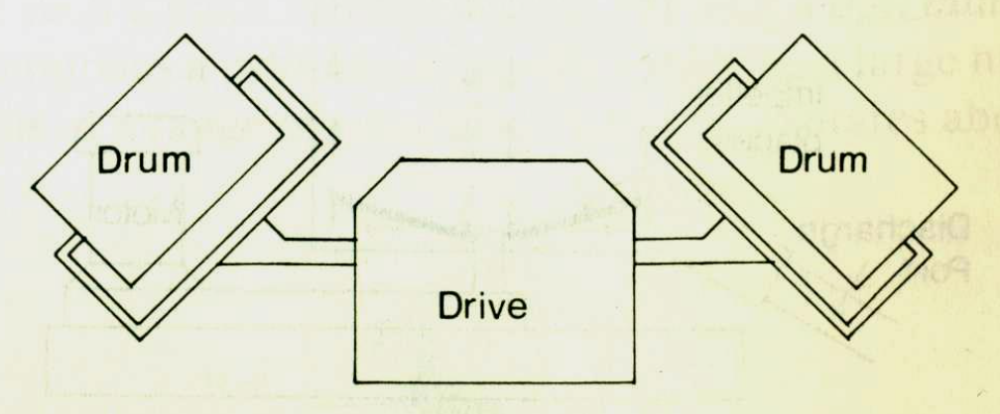
  2. 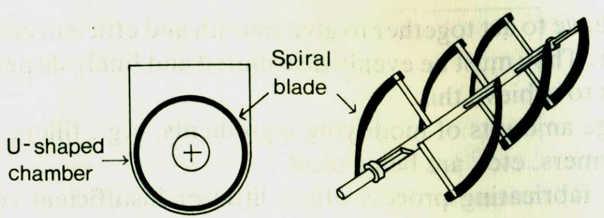
  3. 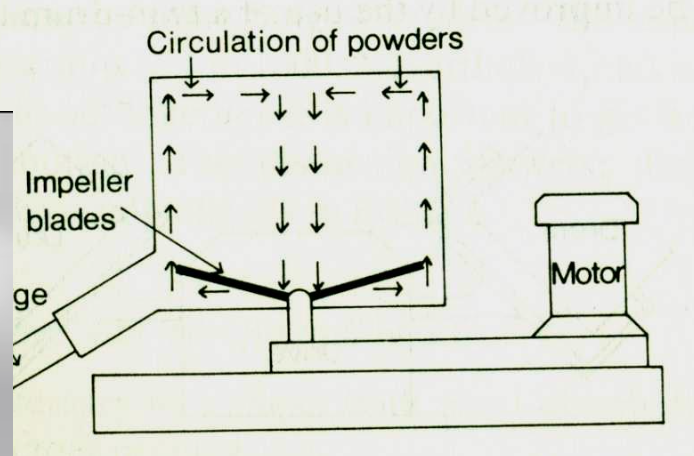
  4. 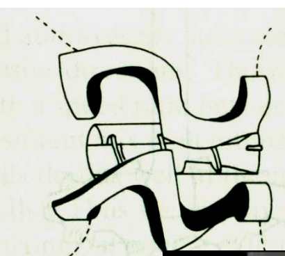
  5. 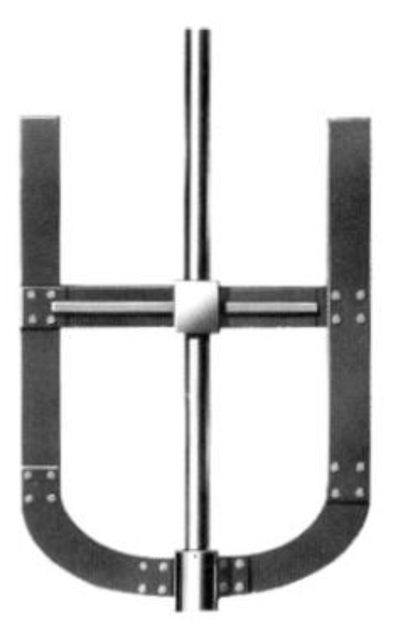
  6. 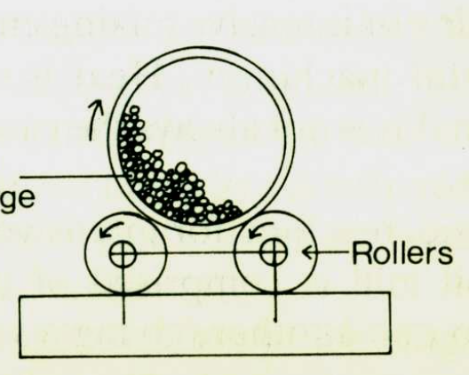
  7. 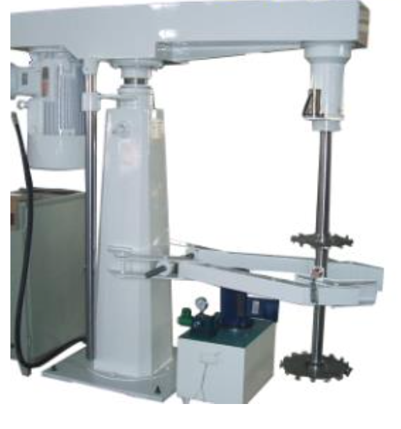
  8. 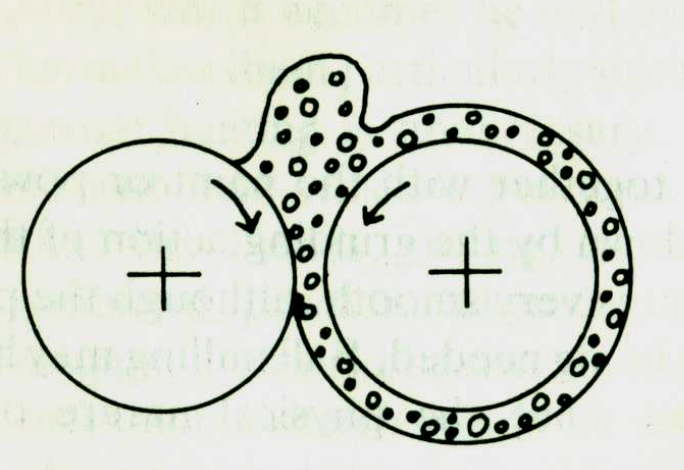
  9. 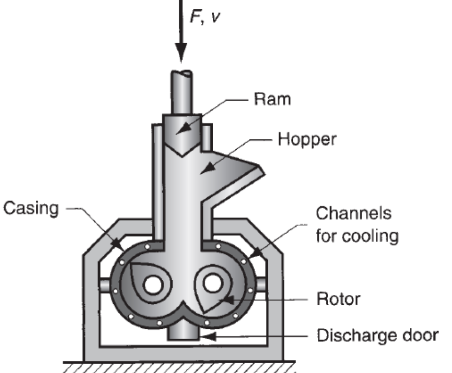
  10. 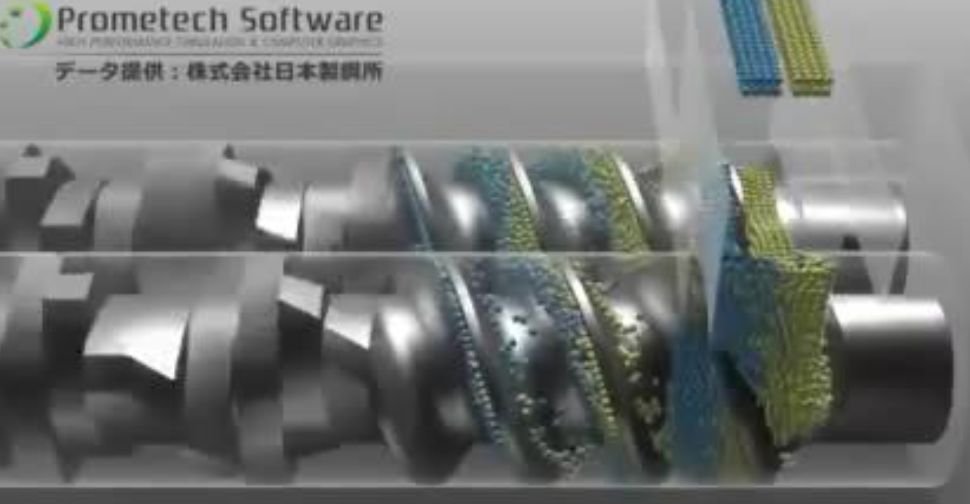

  * 8 부터

* 다음 기기는 dispersive와 distributive 모두 잘한다. 
  

  * ㅗ. dispersive만 잘한다. 

* viscous dissipation이 클수록 혼합이 잘 안된다.

  * ㅗ. 잘 된다. 

* proper machine to compound thermoplastics

  1. 
  2. 1. 
     2. 
     3. 

  

* 점도가 ㅈㄴ 높을 때 dispersion은 적은 에너지로도 된다는 것을 수식으로 보여라 그리고 설명해라
  * 점도가 높으면 잃어버리는 에너지가 적다 . 즉 입자에 전달되는 에너지가 많아서 dispersion이 미친듯이 잘된다.
  * 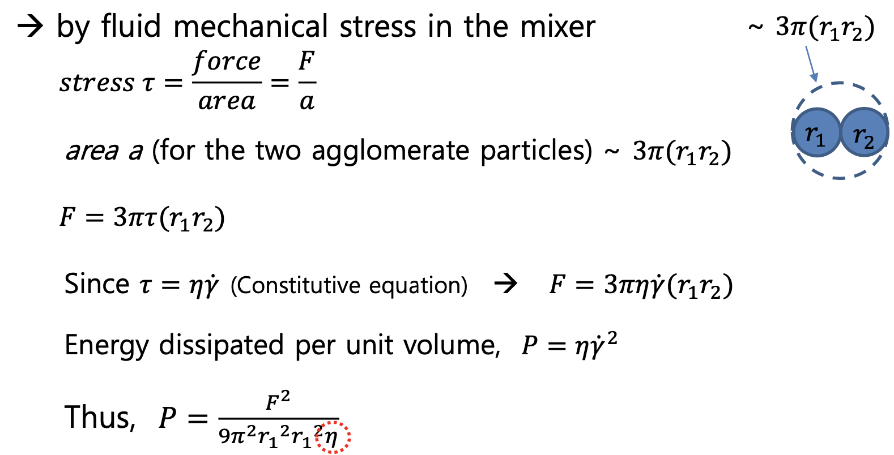

* 녹은 고분자가 distributive하기 어려운 이유는?

  * viscosity가 높아서 Re가 작다. 즉, laminar flow다. 

* Re식

  * 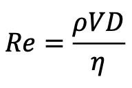
  * 관성력 / 점성력

* Re 크면 turbulent flow다.

  * 맞음. 작으면 laminar flow

* Re의 단위는?

  * ㅗ. 없음.

* |           | distribution (비례 Re) | dispersion(반비례 잃어버리는 에너지) |
  | --------- | ---------------------- | ------------------------------------ |
  | 낮은 점도 | 👍                      | 👎🏽                                   |
  | 높은 점도 | 👎🏽                     | 👍                                    |

  물론 미친 점도는 지들끼리 shear ㅈㄴ 쎄서 distribution이고 dispersion이고 쌈싸먹음.

* NS에서 Re 유도해봐
  * 몰라

