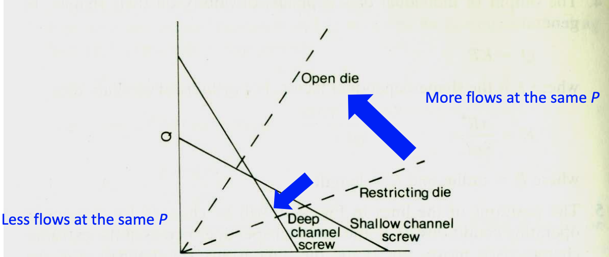
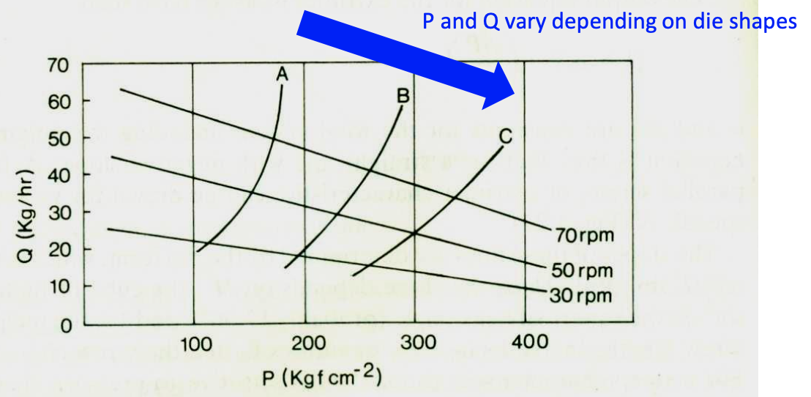
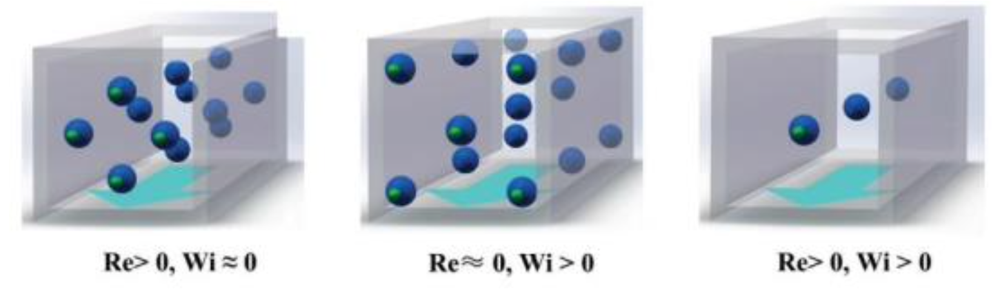

#  Extrusion

* extrusion이란?
  * plastic이나 녹은 재료를 die에 넣고 압력을 가하는 것.

* Extrusion에서 재료의 상태 변화를 읊어봐라
  * 고체 상태의 polymer가 들어가서 녹고, homogeneous해진다.

* extrusion은 blending의 일종이다.
  * ㅗ. compounding임.

* single screw extruder는 channel depth가 일정해서 압력 변화가 없다. 

  * ㅗ. 중간에 channel depth가 얕아지면서 압력 쥰내 커짐

* extruder를 3 단계로 분리해봐라

  * feed zone
  * compression zone
  * metering zone

* feed zone에서 온도 변화는 없다. 

  * ㅗ. 예열 있다

* compression zone에 대한 설명으로 틀린걸 찾아봐라

  1. 공기 제거
  2. 재료가 갈리면서 열 전달률이 떨어진다.
  3. 녹으면서 농도가 증가한다. 
  4. channel depth가 넓어진다.

  * 2 :  열 전달률이 올라간다.
  * 4: 좁아진다.

* die zone에 대한 설명으로 구라인것은

  1. 쓸모없는 성분을 제거한다.
  2. metering zone에서 떠밀려 온 재료에 브레이크를 건다.
  3. turning memory 를 없앤다.

* turning memory가 무어냐

  * 고분자의 점탄성 때문에 녹은 고분자가 특정 형태로 굳어지는 것.

* 냉각기에서 막 건진 고분자가 turning memory 때매 특정 모양을 하고 있는데 그게 하필 twist인 원인은?

  * residual stress

* residual stress 없애려면 어떻게 해야해?

  * 사우나에 장시간 두면 돼

* single screw extruder의 장단점과 단점의 해결 방안?

  * distributive는 구린데 dispersive는 기깔난다.
  * screw flight 각도 & pitch에 변화를 주면 distirbutive 개굿

* 압력이 높아야 가스 배출에 좋음

  * ㅗ. 폭팔시킬 일 있냐. 당연히 낮은 압력이지

* total flow = A - B - C 에서 A, B, C는?

  * A : Drag flow : screw 와 barrel 사이의 마찰로 인한 흐름
  * B : Pressure flow : 압력 변화에 의한 흐름. 실제 flow를 만들지는 않는다.
  * C : Leak flow : 빠꾸하는 흐름

* single screw extruder의 열 발생 요인 두가지

  * viscous heating
  * barrel heater

* 공간이 넓고 속도가 빠를수록 drag flow의 유량이 크다.

  * ㅇㅇ

* 날개가 그늘과 만드는 삼각형의 넓이가 클수록 ,  barrel이 멀리 있을수록 drag flow의 유량이 크다. 

  * ㅇㅇ

* drag flow 유량에 영향을 주는 요인 4가지

  * 비례
    * screw diameter
    * screw speed
    * channel depth
    * helix angle 

* pressure flow 유량에 영향을 주는 요인 4가지

  * 비례
    * 높이
    * screw diameter
    * pressure gradient
  * 반비례
    * viscosity

* leak flow는 screw와 barrel 간격이 넓을 경우에만 유의미하다.

  * 맞음

* total flow 유량에 영향을 주는 요인 4개

  * 비례
    * screw speed
    * viscosity
  * 반비례
    * head pressure

* total flow ?

  * drag flow - pressure flow

* 마찰이 없어야 잘 갈리는데 PVC는 열역학적으로 불안정해서 잘 안갈린다.

  * ㅗ. 마찰이 있어야 잘 갈림

* channel이 깊으면?

  * 많이 수송 가능
  * 녹는데 ㅈㄴ 걸림

* channel이 얕으면?

  * 수송 ㅈㄴ 걸림
  * 빨리 섞기 가능
    * shear 빡세져서 과열됨

* 그래서 helix angle이 서있으면? 누워 있으면?

  * 서있으면?
    * back flow 막을 수 있어
  * 누워있으면?
    * head pressure = 0
    * drag flow 효율 나락

* 적정 helix angle

  * 17.66º

* PVC같이 열역학적으로 불안정한 것을 갈려면 무엇을 줄여야하나?

  * 마찰.

* PVC를 위한 압출기는?

  * twin screw extruders

* twin screw extruders를 분류하는 기준
  * rotation direction
  * screw가 맞물리는지
* die 내부의 압력이 높으면 유량이 적어진다.
  * 맞음
* 다음 빈칸에 들어갈 내용은?
  

* extrusion die entrance가 tapered인 이유는?
  * tensile strength를 줄여서 →  dead spot을 줄여서 → steady heat, shear history, 사출된 streamline의 왜곡을 줄인다.
* De(deborah number) >> 1 이면 elastic? viscous?
  * elastic
* Relaxation time(lambda) = ?
  * viscosity / elastic modulus
* De = ?
  * Relaxation time / time scale
* 빈칸을 채워라
  * 
* shark skin이 나타나는 이유는?
  * Case
    * Structured, highly filled, low elasticity materials
  * Reason
    * 물질이 뿜여져 나올 때 물질은 가속하게 되는데, 이 때 발생한 인장 Stress로 인해 분출 시 defect가 생긴다.
* die에서 extrude되면서 팽창하기만 하진 않는다. 즉 수축하기도 하는데 어떤 조건에서 이 현상이 일어나는가?
  * shear flow에서 nano composite에서 관찰된 large negative normal stress떄문에 일어난다.